# PISA Data
## by Richard Guitter

## Preliminary Wrangling

The Programme for International Student Assessment (PISA) is a triennial international survey which aims to evaluate education systems worldwide by testing the skills and knowledge of 15-year-old students who are nearing the end of their compulsory education. PISA assesses how well they can apply what they learn in school to real-life situations. 

This dataset contains the result of the survey for 2012. 


```python
# import all packages and set plots to be embedded inline
import numpy as np
import pandas as pd
import matplotlib.pyplot as plt
import seaborn as sb

%matplotlib inline

pd.set_option('display.max_columns', 636)
```


```python
pisa = pd.read_csv('pisa2012.csv', encoding='latin-1',
       index_col=0,
       dtype={15: str, 16: str, 17: str, 21: str, 22: str, 23: str, 24: str, 25: str, 26: str, 37: str,
           45: str, 65: str, 123: str, 156: str, 157: str, 158: str, 159: str, 160: str, 161: str,
           162: str, 163: str, 164: str, 165: str, 166: str, 167: str, 168: str, 169: str, 170: str,
           171: str, 284: str, 285: str, 286: str, 287: str, 288: str, 289: str, 290: str, 291: str,
           292: str, 293: str, 294: str, 295: str, 296: str, 297: str, 298: str, 299: str, 300: str,
           301: str, 302: str, 303: str, 307: str, 308: str, 309: str, 310: str, 311: str, 312: str,
           313: str, 314: str, 315: str, 316: str, 317: str, 318: str, 319: str, 320: str, 321: str,
           322: str, 323: str, 324: str, 325: str, 326: str, 327: str, 328: str, 329: str, 330: str,
           331: str, 332: str, 333: str, 334: str, 335: str, 336: str, 337: str, 338: str, 339: str,
           340: str, 341: str, 342: str, 343: str, 344: str, 345: str, 346: str, 347: str, 348: str,
           349: str, 350: str, 351: str, 352: str, 353: str, 354: str, 355: str, 356: str, 357: str,
           376: str, 377: str, 378: str, 379: str, 380: str, 381: str, 382: str, 383: str, 384: str,
           385: str, 386: str, 387: str, 388: str, 389: str, 390: str, 391: str, 392: str, 393: str,
           394: str, 395: str, 396: str, 397: str, 398: str, 399: str, 400: str, 401: str, 402: str,
           403: str, 475: str, 30: str, 31: str, 36: str, 155: str}
)
```


```python
pisa.head()
```


<div>
<style scoped>
    .dataframe tbody tr th:only-of-type {
        vertical-align: middle;
    }

    .dataframe tbody tr th {
        vertical-align: top;
    }

    .dataframe thead th {
        text-align: right;
    }
</style>
<table border="1" class="dataframe">
  <thead>
    <tr style="text-align: right;">
      <th></th>
      <th>CNT</th>
      <th>SUBNATIO</th>
      <th>STRATUM</th>
      <th>OECD</th>
      <th>NC</th>
      <th>SCHOOLID</th>
      <th>STIDSTD</th>
      <th>ST01Q01</th>
      <th>ST02Q01</th>
      <th>ST03Q01</th>
      <th>ST03Q02</th>
      <th>ST04Q01</th>
      <th>ST05Q01</th>
      <th>ST06Q01</th>
      <th>ST07Q01</th>
      <th>ST07Q02</th>
      <th>ST07Q03</th>
      <th>ST08Q01</th>
      <th>ST09Q01</th>
      <th>ST115Q01</th>
      <th>ST11Q01</th>
      <th>ST11Q02</th>
      <th>ST11Q03</th>
      <th>ST11Q04</th>
      <th>ST11Q05</th>
      <th>ST11Q06</th>
      <th>ST13Q01</th>
      <th>ST14Q01</th>
      <th>ST14Q02</th>
      <th>ST14Q03</th>
      <th>ST14Q04</th>
      <th>ST15Q01</th>
      <th>ST17Q01</th>
      <th>ST18Q01</th>
      <th>ST18Q02</th>
      <th>ST18Q03</th>
      <th>ST18Q04</th>
      <th>ST19Q01</th>
      <th>ST20Q01</th>
      <th>ST20Q02</th>
      <th>ST20Q03</th>
      <th>ST21Q01</th>
      <th>ST25Q01</th>
      <th>ST26Q01</th>
      <th>ST26Q02</th>
      <th>ST26Q03</th>
      <th>ST26Q04</th>
      <th>ST26Q05</th>
      <th>ST26Q06</th>
      <th>ST26Q07</th>
      <th>ST26Q08</th>
      <th>ST26Q09</th>
      <th>ST26Q10</th>
      <th>ST26Q11</th>
      <th>ST26Q12</th>
      <th>ST26Q13</th>
      <th>ST26Q14</th>
      <th>ST26Q15</th>
      <th>ST26Q16</th>
      <th>ST26Q17</th>
      <th>ST27Q01</th>
      <th>ST27Q02</th>
      <th>ST27Q03</th>
      <th>ST27Q04</th>
      <th>ST27Q05</th>
      <th>ST28Q01</th>
      <th>ST29Q01</th>
      <th>ST29Q02</th>
      <th>ST29Q03</th>
      <th>ST29Q04</th>
      <th>ST29Q05</th>
      <th>ST29Q06</th>
      <th>ST29Q07</th>
      <th>ST29Q08</th>
      <th>ST35Q01</th>
      <th>ST35Q02</th>
      <th>ST35Q03</th>
      <th>ST35Q04</th>
      <th>ST35Q05</th>
      <th>ST35Q06</th>
      <th>ST37Q01</th>
      <th>ST37Q02</th>
      <th>ST37Q03</th>
      <th>ST37Q04</th>
      <th>ST37Q05</th>
      <th>ST37Q06</th>
      <th>ST37Q07</th>
      <th>ST37Q08</th>
      <th>ST42Q01</th>
      <th>ST42Q02</th>
      <th>ST42Q03</th>
      <th>ST42Q04</th>
      <th>ST42Q05</th>
      <th>ST42Q06</th>
      <th>ST42Q07</th>
      <th>ST42Q08</th>
      <th>ST42Q09</th>
      <th>ST42Q10</th>
      <th>ST43Q01</th>
      <th>ST43Q02</th>
      <th>ST43Q03</th>
      <th>ST43Q04</th>
      <th>ST43Q05</th>
      <th>ST43Q06</th>
      <th>ST44Q01</th>
      <th>ST44Q03</th>
      <th>ST44Q04</th>
      <th>ST44Q05</th>
      <th>ST44Q07</th>
      <th>ST44Q08</th>
      <th>ST46Q01</th>
      <th>ST46Q02</th>
      <th>ST46Q03</th>
      <th>ST46Q04</th>
      <th>ST46Q05</th>
      <th>ST46Q06</th>
      <th>ST46Q07</th>
      <th>ST46Q08</th>
      <th>ST46Q09</th>
      <th>ST48Q01</th>
      <th>ST48Q02</th>
      <th>ST48Q03</th>
      <th>ST48Q04</th>
      <th>ST48Q05</th>
      <th>ST49Q01</th>
      <th>ST49Q02</th>
      <th>ST49Q03</th>
      <th>ST49Q04</th>
      <th>ST49Q05</th>
      <th>ST49Q06</th>
      <th>ST49Q07</th>
      <th>ST49Q09</th>
      <th>ST53Q01</th>
      <th>ST53Q02</th>
      <th>ST53Q03</th>
      <th>ST53Q04</th>
      <th>ST55Q01</th>
      <th>ST55Q02</th>
      <th>ST55Q03</th>
      <th>ST55Q04</th>
      <th>ST57Q01</th>
      <th>ST57Q02</th>
      <th>ST57Q03</th>
      <th>ST57Q04</th>
      <th>ST57Q05</th>
      <th>ST57Q06</th>
      <th>ST61Q01</th>
      <th>ST61Q02</th>
      <th>ST61Q03</th>
      <th>ST61Q04</th>
      <th>ST61Q05</th>
      <th>ST61Q06</th>
      <th>ST61Q07</th>
      <th>ST61Q08</th>
      <th>ST61Q09</th>
      <th>ST62Q01</th>
      <th>ST62Q02</th>
      <th>ST62Q03</th>
      <th>ST62Q04</th>
      <th>ST62Q06</th>
      <th>ST62Q07</th>
      <th>ST62Q08</th>
      <th>ST62Q09</th>
      <th>ST62Q10</th>
      <th>ST62Q11</th>
      <th>ST62Q12</th>
      <th>ST62Q13</th>
      <th>ST62Q15</th>
      <th>ST62Q16</th>
      <th>ST62Q17</th>
      <th>ST62Q19</th>
      <th>ST69Q01</th>
      <th>ST69Q02</th>
      <th>ST69Q03</th>
      <th>ST70Q01</th>
      <th>ST70Q02</th>
      <th>ST70Q03</th>
      <th>ST71Q01</th>
      <th>ST72Q01</th>
      <th>ST73Q01</th>
      <th>ST73Q02</th>
      <th>ST74Q01</th>
      <th>ST74Q02</th>
      <th>ST75Q01</th>
      <th>ST75Q02</th>
      <th>ST76Q01</th>
      <th>ST76Q02</th>
      <th>ST77Q01</th>
      <th>ST77Q02</th>
      <th>ST77Q04</th>
      <th>ST77Q05</th>
      <th>ST77Q06</th>
      <th>ST79Q01</th>
      <th>ST79Q02</th>
      <th>ST79Q03</th>
      <th>ST79Q04</th>
      <th>ST79Q05</th>
      <th>ST79Q06</th>
      <th>ST79Q07</th>
      <th>ST79Q08</th>
      <th>ST79Q10</th>
      <th>ST79Q11</th>
      <th>ST79Q12</th>
      <th>ST79Q15</th>
      <th>ST79Q17</th>
      <th>ST80Q01</th>
      <th>ST80Q04</th>
      <th>ST80Q05</th>
      <th>ST80Q06</th>
      <th>ST80Q07</th>
      <th>ST80Q08</th>
      <th>ST80Q09</th>
      <th>ST80Q10</th>
      <th>ST80Q11</th>
      <th>ST81Q01</th>
      <th>ST81Q02</th>
      <th>ST81Q03</th>
      <th>ST81Q04</th>
      <th>ST81Q05</th>
      <th>ST82Q01</th>
      <th>ST82Q02</th>
      <th>ST82Q03</th>
      <th>ST83Q01</th>
      <th>ST83Q02</th>
      <th>ST83Q03</th>
      <th>ST83Q04</th>
      <th>ST84Q01</th>
      <th>ST84Q02</th>
      <th>ST84Q03</th>
      <th>ST85Q01</th>
      <th>ST85Q02</th>
      <th>ST85Q03</th>
      <th>ST85Q04</th>
      <th>ST86Q01</th>
      <th>ST86Q02</th>
      <th>ST86Q03</th>
      <th>ST86Q04</th>
      <th>ST86Q05</th>
      <th>ST87Q01</th>
      <th>ST87Q02</th>
      <th>ST87Q03</th>
      <th>ST87Q04</th>
      <th>ST87Q05</th>
      <th>ST87Q06</th>
      <th>ST87Q07</th>
      <th>ST87Q08</th>
      <th>ST87Q09</th>
      <th>ST88Q01</th>
      <th>ST88Q02</th>
      <th>ST88Q03</th>
      <th>ST88Q04</th>
      <th>ST89Q02</th>
      <th>ST89Q03</th>
      <th>ST89Q04</th>
      <th>ST89Q05</th>
      <th>ST91Q01</th>
      <th>ST91Q02</th>
      <th>ST91Q03</th>
      <th>ST91Q04</th>
      <th>ST91Q05</th>
      <th>ST91Q06</th>
      <th>ST93Q01</th>
      <th>ST93Q03</th>
      <th>ST93Q04</th>
      <th>ST93Q06</th>
      <th>ST93Q07</th>
      <th>ST94Q05</th>
      <th>ST94Q06</th>
      <th>ST94Q09</th>
      <th>ST94Q10</th>
      <th>ST94Q14</th>
      <th>ST96Q01</th>
      <th>ST96Q02</th>
      <th>ST96Q03</th>
      <th>ST96Q05</th>
      <th>ST101Q01</th>
      <th>ST101Q02</th>
      <th>ST101Q03</th>
      <th>ST101Q05</th>
      <th>ST104Q01</th>
      <th>ST104Q04</th>
      <th>ST104Q05</th>
      <th>ST104Q06</th>
      <th>IC01Q01</th>
      <th>IC01Q02</th>
      <th>IC01Q03</th>
      <th>IC01Q04</th>
      <th>IC01Q05</th>
      <th>IC01Q06</th>
      <th>IC01Q07</th>
      <th>IC01Q08</th>
      <th>IC01Q09</th>
      <th>IC01Q10</th>
      <th>IC01Q11</th>
      <th>IC02Q01</th>
      <th>IC02Q02</th>
      <th>IC02Q03</th>
      <th>IC02Q04</th>
      <th>IC02Q05</th>
      <th>IC02Q06</th>
      <th>IC02Q07</th>
      <th>IC03Q01</th>
      <th>IC04Q01</th>
      <th>IC05Q01</th>
      <th>IC06Q01</th>
      <th>IC07Q01</th>
      <th>IC08Q01</th>
      <th>IC08Q02</th>
      <th>IC08Q03</th>
      <th>IC08Q04</th>
      <th>IC08Q05</th>
      <th>IC08Q06</th>
      <th>IC08Q07</th>
      <th>IC08Q08</th>
      <th>IC08Q09</th>
      <th>IC08Q11</th>
      <th>IC09Q01</th>
      <th>IC09Q02</th>
      <th>IC09Q03</th>
      <th>IC09Q04</th>
      <th>IC09Q05</th>
      <th>IC09Q06</th>
      <th>IC09Q07</th>
      <th>IC10Q01</th>
      <th>IC10Q02</th>
      <th>IC10Q03</th>
      <th>IC10Q04</th>
      <th>IC10Q05</th>
      <th>IC10Q06</th>
      <th>IC10Q07</th>
      <th>IC10Q08</th>
      <th>IC10Q09</th>
      <th>IC11Q01</th>
      <th>IC11Q02</th>
      <th>IC11Q03</th>
      <th>IC11Q04</th>
      <th>IC11Q05</th>
      <th>IC11Q06</th>
      <th>IC11Q07</th>
      <th>IC22Q01</th>
      <th>IC22Q02</th>
      <th>IC22Q04</th>
      <th>IC22Q06</th>
      <th>IC22Q07</th>
      <th>IC22Q08</th>
      <th>EC01Q01</th>
      <th>EC02Q01</th>
      <th>EC03Q01</th>
      <th>EC03Q02</th>
      <th>EC03Q03</th>
      <th>EC03Q04</th>
      <th>EC03Q05</th>
      <th>EC03Q06</th>
      <th>EC03Q07</th>
      <th>EC03Q08</th>
      <th>EC03Q09</th>
      <th>EC03Q10</th>
      <th>EC04Q01A</th>
      <th>EC04Q01B</th>
      <th>EC04Q01C</th>
      <th>EC04Q02A</th>
      <th>EC04Q02B</th>
      <th>EC04Q02C</th>
      <th>EC04Q03A</th>
      <th>EC04Q03B</th>
      <th>EC04Q03C</th>
      <th>EC04Q04A</th>
      <th>EC04Q04B</th>
      <th>EC04Q04C</th>
      <th>EC04Q05A</th>
      <th>EC04Q05B</th>
      <th>EC04Q05C</th>
      <th>EC04Q06A</th>
      <th>EC04Q06B</th>
      <th>EC04Q06C</th>
      <th>EC05Q01</th>
      <th>EC06Q01</th>
      <th>EC07Q01</th>
      <th>EC07Q02</th>
      <th>EC07Q03</th>
      <th>EC07Q04</th>
      <th>EC07Q05</th>
      <th>EC08Q01</th>
      <th>EC08Q02</th>
      <th>EC08Q03</th>
      <th>EC08Q04</th>
      <th>EC09Q03</th>
      <th>EC10Q01</th>
      <th>EC11Q02</th>
      <th>EC11Q03</th>
      <th>EC12Q01</th>
      <th>ST22Q01</th>
      <th>ST23Q01</th>
      <th>ST23Q02</th>
      <th>ST23Q03</th>
      <th>ST23Q04</th>
      <th>ST23Q05</th>
      <th>ST23Q06</th>
      <th>ST23Q07</th>
      <th>ST23Q08</th>
      <th>ST24Q01</th>
      <th>ST24Q02</th>
      <th>ST24Q03</th>
      <th>CLCUSE1</th>
      <th>CLCUSE301</th>
      <th>CLCUSE302</th>
      <th>DEFFORT</th>
      <th>QUESTID</th>
      <th>BOOKID</th>
      <th>EASY</th>
      <th>AGE</th>
      <th>GRADE</th>
      <th>PROGN</th>
      <th>ANXMAT</th>
      <th>ATSCHL</th>
      <th>ATTLNACT</th>
      <th>BELONG</th>
      <th>BFMJ2</th>
      <th>BMMJ1</th>
      <th>CLSMAN</th>
      <th>COBN_F</th>
      <th>COBN_M</th>
      <th>COBN_S</th>
      <th>COGACT</th>
      <th>CULTDIST</th>
      <th>CULTPOS</th>
      <th>DISCLIMA</th>
      <th>ENTUSE</th>
      <th>ESCS</th>
      <th>EXAPPLM</th>
      <th>EXPUREM</th>
      <th>FAILMAT</th>
      <th>FAMCON</th>
      <th>FAMCONC</th>
      <th>FAMSTRUC</th>
      <th>FISCED</th>
      <th>HEDRES</th>
      <th>HERITCUL</th>
      <th>HISCED</th>
      <th>HISEI</th>
      <th>HOMEPOS</th>
      <th>HOMSCH</th>
      <th>HOSTCUL</th>
      <th>ICTATTNEG</th>
      <th>ICTATTPOS</th>
      <th>ICTHOME</th>
      <th>ICTRES</th>
      <th>ICTSCH</th>
      <th>IMMIG</th>
      <th>INFOCAR</th>
      <th>INFOJOB1</th>
      <th>INFOJOB2</th>
      <th>INSTMOT</th>
      <th>INTMAT</th>
      <th>ISCEDD</th>
      <th>ISCEDL</th>
      <th>ISCEDO</th>
      <th>LANGCOMM</th>
      <th>LANGN</th>
      <th>LANGRPPD</th>
      <th>LMINS</th>
      <th>MATBEH</th>
      <th>MATHEFF</th>
      <th>MATINTFC</th>
      <th>MATWKETH</th>
      <th>MISCED</th>
      <th>MMINS</th>
      <th>MTSUP</th>
      <th>OCOD1</th>
      <th>OCOD2</th>
      <th>OPENPS</th>
      <th>OUTHOURS</th>
      <th>PARED</th>
      <th>PERSEV</th>
      <th>REPEAT</th>
      <th>SCMAT</th>
      <th>SMINS</th>
      <th>STUDREL</th>
      <th>SUBNORM</th>
      <th>TCHBEHFA</th>
      <th>TCHBEHSO</th>
      <th>TCHBEHTD</th>
      <th>TEACHSUP</th>
      <th>TESTLANG</th>
      <th>TIMEINT</th>
      <th>USEMATH</th>
      <th>USESCH</th>
      <th>WEALTH</th>
      <th>ANCATSCHL</th>
      <th>ANCATTLNACT</th>
      <th>ANCBELONG</th>
      <th>ANCCLSMAN</th>
      <th>ANCCOGACT</th>
      <th>ANCINSTMOT</th>
      <th>ANCINTMAT</th>
      <th>ANCMATWKETH</th>
      <th>ANCMTSUP</th>
      <th>ANCSCMAT</th>
      <th>ANCSTUDREL</th>
      <th>ANCSUBNORM</th>
      <th>PV1MATH</th>
      <th>PV2MATH</th>
      <th>PV3MATH</th>
      <th>PV4MATH</th>
      <th>PV5MATH</th>
      <th>PV1MACC</th>
      <th>PV2MACC</th>
      <th>PV3MACC</th>
      <th>PV4MACC</th>
      <th>PV5MACC</th>
      <th>PV1MACQ</th>
      <th>PV2MACQ</th>
      <th>PV3MACQ</th>
      <th>PV4MACQ</th>
      <th>PV5MACQ</th>
      <th>PV1MACS</th>
      <th>PV2MACS</th>
      <th>PV3MACS</th>
      <th>PV4MACS</th>
      <th>PV5MACS</th>
      <th>PV1MACU</th>
      <th>PV2MACU</th>
      <th>PV3MACU</th>
      <th>PV4MACU</th>
      <th>PV5MACU</th>
      <th>PV1MAPE</th>
      <th>PV2MAPE</th>
      <th>PV3MAPE</th>
      <th>PV4MAPE</th>
      <th>PV5MAPE</th>
      <th>PV1MAPF</th>
      <th>PV2MAPF</th>
      <th>PV3MAPF</th>
      <th>PV4MAPF</th>
      <th>PV5MAPF</th>
      <th>PV1MAPI</th>
      <th>PV2MAPI</th>
      <th>PV3MAPI</th>
      <th>PV4MAPI</th>
      <th>PV5MAPI</th>
      <th>PV1READ</th>
      <th>PV2READ</th>
      <th>PV3READ</th>
      <th>PV4READ</th>
      <th>PV5READ</th>
      <th>PV1SCIE</th>
      <th>PV2SCIE</th>
      <th>PV3SCIE</th>
      <th>PV4SCIE</th>
      <th>PV5SCIE</th>
      <th>W_FSTUWT</th>
      <th>W_FSTR1</th>
      <th>W_FSTR2</th>
      <th>W_FSTR3</th>
      <th>W_FSTR4</th>
      <th>W_FSTR5</th>
      <th>W_FSTR6</th>
      <th>W_FSTR7</th>
      <th>W_FSTR8</th>
      <th>W_FSTR9</th>
      <th>W_FSTR10</th>
      <th>W_FSTR11</th>
      <th>W_FSTR12</th>
      <th>W_FSTR13</th>
      <th>W_FSTR14</th>
      <th>W_FSTR15</th>
      <th>W_FSTR16</th>
      <th>W_FSTR17</th>
      <th>W_FSTR18</th>
      <th>W_FSTR19</th>
      <th>W_FSTR20</th>
      <th>W_FSTR21</th>
      <th>W_FSTR22</th>
      <th>W_FSTR23</th>
      <th>W_FSTR24</th>
      <th>W_FSTR25</th>
      <th>W_FSTR26</th>
      <th>W_FSTR27</th>
      <th>W_FSTR28</th>
      <th>W_FSTR29</th>
      <th>W_FSTR30</th>
      <th>W_FSTR31</th>
      <th>W_FSTR32</th>
      <th>W_FSTR33</th>
      <th>W_FSTR34</th>
      <th>W_FSTR35</th>
      <th>W_FSTR36</th>
      <th>W_FSTR37</th>
      <th>W_FSTR38</th>
      <th>W_FSTR39</th>
      <th>W_FSTR40</th>
      <th>W_FSTR41</th>
      <th>W_FSTR42</th>
      <th>W_FSTR43</th>
      <th>W_FSTR44</th>
      <th>W_FSTR45</th>
      <th>W_FSTR46</th>
      <th>W_FSTR47</th>
      <th>W_FSTR48</th>
      <th>W_FSTR49</th>
      <th>W_FSTR50</th>
      <th>W_FSTR51</th>
      <th>W_FSTR52</th>
      <th>W_FSTR53</th>
      <th>W_FSTR54</th>
      <th>W_FSTR55</th>
      <th>W_FSTR56</th>
      <th>W_FSTR57</th>
      <th>W_FSTR58</th>
      <th>W_FSTR59</th>
      <th>W_FSTR60</th>
      <th>W_FSTR61</th>
      <th>W_FSTR62</th>
      <th>W_FSTR63</th>
      <th>W_FSTR64</th>
      <th>W_FSTR65</th>
      <th>W_FSTR66</th>
      <th>W_FSTR67</th>
      <th>W_FSTR68</th>
      <th>W_FSTR69</th>
      <th>W_FSTR70</th>
      <th>W_FSTR71</th>
      <th>W_FSTR72</th>
      <th>W_FSTR73</th>
      <th>W_FSTR74</th>
      <th>W_FSTR75</th>
      <th>W_FSTR76</th>
      <th>W_FSTR77</th>
      <th>W_FSTR78</th>
      <th>W_FSTR79</th>
      <th>W_FSTR80</th>
      <th>WVARSTRR</th>
      <th>VAR_UNIT</th>
      <th>SENWGT_STU</th>
      <th>VER_STU</th>
    </tr>
  </thead>
  <tbody>
    <tr>
      <th>1</th>
      <td>Albania</td>
      <td>80000</td>
      <td>ALB0006</td>
      <td>Non-OECD</td>
      <td>Albania</td>
      <td>1</td>
      <td>1</td>
      <td>10</td>
      <td>1.0</td>
      <td>2</td>
      <td>1996</td>
      <td>Female</td>
      <td>No</td>
      <td>6.0</td>
      <td>No, never</td>
      <td>No, never</td>
      <td>No, never</td>
      <td>None</td>
      <td>None</td>
      <td>1.0</td>
      <td>Yes</td>
      <td>Yes</td>
      <td>Yes</td>
      <td>Yes</td>
      <td>NaN</td>
      <td>NaN</td>
      <td>&lt;ISCED level 3A&gt;</td>
      <td>No</td>
      <td>No</td>
      <td>No</td>
      <td>No</td>
      <td>Other (e.g. home duties, retired)</td>
      <td>&lt;ISCED level 3A&gt;</td>
      <td>NaN</td>
      <td>NaN</td>
      <td>NaN</td>
      <td>NaN</td>
      <td>Working part-time &lt;for pay&gt;</td>
      <td>Country of test</td>
      <td>Country of test</td>
      <td>Country of test</td>
      <td>NaN</td>
      <td>Language of the test</td>
      <td>Yes</td>
      <td>No</td>
      <td>Yes</td>
      <td>No</td>
      <td>No</td>
      <td>No</td>
      <td>No</td>
      <td>Yes</td>
      <td>No</td>
      <td>Yes</td>
      <td>No</td>
      <td>Yes</td>
      <td>No</td>
      <td>Yes</td>
      <td>8002</td>
      <td>8001</td>
      <td>8002</td>
      <td>Two</td>
      <td>One</td>
      <td>None</td>
      <td>None</td>
      <td>None</td>
      <td>0-10 books</td>
      <td>Agree</td>
      <td>Strongly agree</td>
      <td>Agree</td>
      <td>Agree</td>
      <td>Agree</td>
      <td>Agree</td>
      <td>Agree</td>
      <td>Strongly agree</td>
      <td>Disagree</td>
      <td>Agree</td>
      <td>Disagree</td>
      <td>Agree</td>
      <td>Agree</td>
      <td>Agree</td>
      <td>Not at all confident</td>
      <td>Not very confident</td>
      <td>Confident</td>
      <td>Confident</td>
      <td>Confident</td>
      <td>Not at all confident</td>
      <td>Confident</td>
      <td>Very confident</td>
      <td>Agree</td>
      <td>Disagree</td>
      <td>Agree</td>
      <td>Agree</td>
      <td>Agree</td>
      <td>Agree</td>
      <td>Agree</td>
      <td>Disagree</td>
      <td>Disagree</td>
      <td>Disagree</td>
      <td>Agree</td>
      <td>Disagree</td>
      <td>Disagree</td>
      <td>Agree</td>
      <td>NaN</td>
      <td>Disagree</td>
      <td>Likely</td>
      <td>Slightly likely</td>
      <td>Likely</td>
      <td>Likely</td>
      <td>Likely</td>
      <td>Very   Likely</td>
      <td>Agree</td>
      <td>Agree</td>
      <td>Agree</td>
      <td>Agree</td>
      <td>Agree</td>
      <td>Agree</td>
      <td>Agree</td>
      <td>Agree</td>
      <td>Agree</td>
      <td>Courses after school Test Language</td>
      <td>Major in college Science</td>
      <td>Study harder Test Language</td>
      <td>Maximum classes Science</td>
      <td>Pursuing a career Math</td>
      <td>Often</td>
      <td>Sometimes</td>
      <td>Sometimes</td>
      <td>Sometimes</td>
      <td>Sometimes</td>
      <td>Never or rarely</td>
      <td>Never or rarely</td>
      <td>Never or rarely</td>
      <td>NaN</td>
      <td>NaN</td>
      <td>NaN</td>
      <td>NaN</td>
      <td>NaN</td>
      <td>NaN</td>
      <td>NaN</td>
      <td>NaN</td>
      <td>NaN</td>
      <td>NaN</td>
      <td>NaN</td>
      <td>NaN</td>
      <td>NaN</td>
      <td>NaN</td>
      <td>NaN</td>
      <td>NaN</td>
      <td>NaN</td>
      <td>NaN</td>
      <td>NaN</td>
      <td>NaN</td>
      <td>NaN</td>
      <td>NaN</td>
      <td>NaN</td>
      <td>NaN</td>
      <td>NaN</td>
      <td>NaN</td>
      <td>NaN</td>
      <td>NaN</td>
      <td>NaN</td>
      <td>NaN</td>
      <td>NaN</td>
      <td>NaN</td>
      <td>NaN</td>
      <td>NaN</td>
      <td>NaN</td>
      <td>NaN</td>
      <td>NaN</td>
      <td>NaN</td>
      <td>NaN</td>
      <td>NaN</td>
      <td>NaN</td>
      <td>NaN</td>
      <td>NaN</td>
      <td>NaN</td>
      <td>NaN</td>
      <td>NaN</td>
      <td>NaN</td>
      <td>NaN</td>
      <td>NaN</td>
      <td>NaN</td>
      <td>NaN</td>
      <td>NaN</td>
      <td>NaN</td>
      <td>NaN</td>
      <td>NaN</td>
      <td>Every Lesson</td>
      <td>Every Lesson</td>
      <td>Every Lesson</td>
      <td>Every Lesson</td>
      <td>Every Lesson</td>
      <td>Never or Hardly Ever</td>
      <td>Most Lessons</td>
      <td>Never or Hardly Ever</td>
      <td>Every Lesson</td>
      <td>Most Lessons</td>
      <td>Every Lesson</td>
      <td>Every Lesson</td>
      <td>Every Lesson</td>
      <td>Never or Hardly Ever</td>
      <td>Most Lessons</td>
      <td>Every Lesson</td>
      <td>Every Lesson</td>
      <td>Every Lesson</td>
      <td>Always or almost always</td>
      <td>Sometimes</td>
      <td>Never or rarely</td>
      <td>Always or almost always</td>
      <td>Always or almost always</td>
      <td>Always or almost always</td>
      <td>Always or almost always</td>
      <td>Often</td>
      <td>Often</td>
      <td>Never or Hardly Ever</td>
      <td>Never or Hardly Ever</td>
      <td>Never or Hardly Ever</td>
      <td>Never or Hardly Ever</td>
      <td>Never or Hardly Ever</td>
      <td>Strongly disagree</td>
      <td>Strongly disagree</td>
      <td>Strongly disagree</td>
      <td>Strongly disagree</td>
      <td>Agree</td>
      <td>Agree</td>
      <td>Agree</td>
      <td>Strongly agree</td>
      <td>Strongly agree</td>
      <td>Disagree</td>
      <td>Agree</td>
      <td>Strongly disagree</td>
      <td>Disagree</td>
      <td>Agree</td>
      <td>Agree</td>
      <td>Strongly disagree</td>
      <td>Agree</td>
      <td>Agree</td>
      <td>Disagree</td>
      <td>Agree</td>
      <td>Agree</td>
      <td>Strongly disagree</td>
      <td>Strongly agree</td>
      <td>Strongly agree</td>
      <td>Strongly disagree</td>
      <td>Agree</td>
      <td>Strongly disagree</td>
      <td>Agree</td>
      <td>Agree</td>
      <td>Strongly agree</td>
      <td>Strongly disagree</td>
      <td>Strongly disagree</td>
      <td>Agree</td>
      <td>Strongly agree</td>
      <td>Strongly agree</td>
      <td>Strongly agree</td>
      <td>Strongly agree</td>
      <td>Strongly agree</td>
      <td>Strongly agree</td>
      <td>Strongly disagree</td>
      <td>Disagree</td>
      <td>Strongly disagree</td>
      <td>Very much like me</td>
      <td>Very much like me</td>
      <td>Very much like me</td>
      <td>Somewhat like me</td>
      <td>Very much like me</td>
      <td>Somewhat like me</td>
      <td>Mostly like me</td>
      <td>Mostly like me</td>
      <td>Mostly like me</td>
      <td>Somewhat like me</td>
      <td>definitely do this</td>
      <td>definitely do this</td>
      <td>definitely do this</td>
      <td>definitely do this</td>
      <td>4.0</td>
      <td>2.0</td>
      <td>1.0</td>
      <td>1.0</td>
      <td>1.0</td>
      <td>2.0</td>
      <td>1.0</td>
      <td>1.0</td>
      <td>NaN</td>
      <td>NaN</td>
      <td>NaN</td>
      <td>NaN</td>
      <td>NaN</td>
      <td>NaN</td>
      <td>NaN</td>
      <td>NaN</td>
      <td>NaN</td>
      <td>NaN</td>
      <td>NaN</td>
      <td>NaN</td>
      <td>NaN</td>
      <td>NaN</td>
      <td>NaN</td>
      <td>NaN</td>
      <td>NaN</td>
      <td>NaN</td>
      <td>NaN</td>
      <td>NaN</td>
      <td>99</td>
      <td>99</td>
      <td>99</td>
      <td>NaN</td>
      <td>NaN</td>
      <td>NaN</td>
      <td>NaN</td>
      <td>NaN</td>
      <td>NaN</td>
      <td>NaN</td>
      <td>NaN</td>
      <td>NaN</td>
      <td>NaN</td>
      <td>NaN</td>
      <td>NaN</td>
      <td>NaN</td>
      <td>NaN</td>
      <td>NaN</td>
      <td>NaN</td>
      <td>NaN</td>
      <td>NaN</td>
      <td>NaN</td>
      <td>NaN</td>
      <td>NaN</td>
      <td>NaN</td>
      <td>NaN</td>
      <td>NaN</td>
      <td>NaN</td>
      <td>NaN</td>
      <td>NaN</td>
      <td>NaN</td>
      <td>NaN</td>
      <td>NaN</td>
      <td>NaN</td>
      <td>NaN</td>
      <td>NaN</td>
      <td>NaN</td>
      <td>NaN</td>
      <td>NaN</td>
      <td>NaN</td>
      <td>NaN</td>
      <td>NaN</td>
      <td>NaN</td>
      <td>NaN</td>
      <td>NaN</td>
      <td>NaN</td>
      <td>NaN</td>
      <td>NaN</td>
      <td>NaN</td>
      <td>NaN</td>
      <td>NaN</td>
      <td>NaN</td>
      <td>NaN</td>
      <td>NaN</td>
      <td>NaN</td>
      <td>NaN</td>
      <td>NaN</td>
      <td>NaN</td>
      <td>NaN</td>
      <td>NaN</td>
      <td>NaN</td>
      <td>NaN</td>
      <td>NaN</td>
      <td>NaN</td>
      <td>NaN</td>
      <td>NaN</td>
      <td>NaN</td>
      <td>NaN</td>
      <td>NaN</td>
      <td>NaN</td>
      <td>NaN</td>
      <td>NaN</td>
      <td>NaN</td>
      <td>NaN</td>
      <td>NaN</td>
      <td>NaN</td>
      <td>NaN</td>
      <td>NaN</td>
      <td>NaN</td>
      <td>NaN</td>
      <td>NaN</td>
      <td>NaN</td>
      <td>NaN</td>
      <td>NaN</td>
      <td>NaN</td>
      <td>NaN</td>
      <td>NaN</td>
      <td>NaN</td>
      <td>NaN</td>
      <td>NaN</td>
      <td>NaN</td>
      <td>NaN</td>
      <td>NaN</td>
      <td>NaN</td>
      <td>NaN</td>
      <td>NaN</td>
      <td>NaN</td>
      <td>NaN</td>
      <td>NaN</td>
      <td>NaN</td>
      <td>A Simple calculator</td>
      <td>99</td>
      <td>99</td>
      <td>99</td>
      <td>StQ Form B</td>
      <td>booklet 7</td>
      <td>Standard set of booklets</td>
      <td>16.17</td>
      <td>0.0</td>
      <td>Albania: Upper secondary education</td>
      <td>0.32</td>
      <td>-2.31</td>
      <td>0.5206</td>
      <td>-1.18</td>
      <td>76.49</td>
      <td>79.74</td>
      <td>-1.3771</td>
      <td>Albania</td>
      <td>Albania</td>
      <td>Albania</td>
      <td>0.6994</td>
      <td>NaN</td>
      <td>-0.48</td>
      <td>1.85</td>
      <td>NaN</td>
      <td>NaN</td>
      <td>NaN</td>
      <td>NaN</td>
      <td>0.6400</td>
      <td>NaN</td>
      <td>NaN</td>
      <td>2.0</td>
      <td>ISCED 3A, ISCED 4</td>
      <td>-1.29</td>
      <td>NaN</td>
      <td>ISCED 3A, ISCED 4</td>
      <td>NaN</td>
      <td>-2.61</td>
      <td>NaN</td>
      <td>NaN</td>
      <td>NaN</td>
      <td>NaN</td>
      <td>NaN</td>
      <td>-3.16</td>
      <td>NaN</td>
      <td>Native</td>
      <td>NaN</td>
      <td>NaN</td>
      <td>NaN</td>
      <td>0.80</td>
      <td>0.91</td>
      <td>A</td>
      <td>ISCED level 3</td>
      <td>General</td>
      <td>NaN</td>
      <td>Albanian</td>
      <td>NaN</td>
      <td>NaN</td>
      <td>0.6426</td>
      <td>-0.77</td>
      <td>-0.7332</td>
      <td>0.2882</td>
      <td>ISCED 3A, ISCED 4</td>
      <td>NaN</td>
      <td>-0.9508</td>
      <td>Building architects</td>
      <td>Primary school teachers</td>
      <td>0.0521</td>
      <td>NaN</td>
      <td>12.0</td>
      <td>-0.3407</td>
      <td>Did not repeat a &lt;grade&gt;</td>
      <td>0.41</td>
      <td>NaN</td>
      <td>-1.04</td>
      <td>-0.0455</td>
      <td>1.3625</td>
      <td>0.9374</td>
      <td>0.4297</td>
      <td>1.68</td>
      <td>Albanian</td>
      <td>NaN</td>
      <td>NaN</td>
      <td>NaN</td>
      <td>-2.92</td>
      <td>-1.8636</td>
      <td>-0.6779</td>
      <td>-0.7351</td>
      <td>-0.7808</td>
      <td>-0.0219</td>
      <td>-0.1562</td>
      <td>0.0486</td>
      <td>-0.2199</td>
      <td>-0.5983</td>
      <td>-0.0807</td>
      <td>-0.5901</td>
      <td>-0.3346</td>
      <td>406.8469</td>
      <td>376.4683</td>
      <td>344.5319</td>
      <td>321.1637</td>
      <td>381.9209</td>
      <td>325.8374</td>
      <td>324.2795</td>
      <td>279.8800</td>
      <td>267.4170</td>
      <td>312.5954</td>
      <td>409.1837</td>
      <td>388.1524</td>
      <td>373.3525</td>
      <td>389.7102</td>
      <td>415.4152</td>
      <td>351.5423</td>
      <td>375.6894</td>
      <td>341.4161</td>
      <td>386.5945</td>
      <td>426.3203</td>
      <td>396.7207</td>
      <td>334.4057</td>
      <td>328.9531</td>
      <td>339.8582</td>
      <td>354.6580</td>
      <td>324.2795</td>
      <td>345.3108</td>
      <td>381.1419</td>
      <td>380.3630</td>
      <td>346.8687</td>
      <td>319.6059</td>
      <td>345.3108</td>
      <td>360.8895</td>
      <td>390.4892</td>
      <td>322.7216</td>
      <td>290.7852</td>
      <td>345.3108</td>
      <td>326.6163</td>
      <td>407.6258</td>
      <td>367.1210</td>
      <td>249.5762</td>
      <td>254.3420</td>
      <td>406.8496</td>
      <td>175.7053</td>
      <td>218.5981</td>
      <td>341.7009</td>
      <td>408.8400</td>
      <td>348.2283</td>
      <td>367.8105</td>
      <td>392.9877</td>
      <td>8.9096</td>
      <td>13.1249</td>
      <td>13.0829</td>
      <td>4.5315</td>
      <td>13.0829</td>
      <td>13.9235</td>
      <td>13.1249</td>
      <td>13.1249</td>
      <td>4.3389</td>
      <td>4.3313</td>
      <td>13.7954</td>
      <td>4.5315</td>
      <td>4.3313</td>
      <td>13.7954</td>
      <td>13.9235</td>
      <td>4.3389</td>
      <td>4.3313</td>
      <td>4.5084</td>
      <td>4.5084</td>
      <td>13.7954</td>
      <td>4.5315</td>
      <td>13.1249</td>
      <td>13.0829</td>
      <td>4.5315</td>
      <td>13.0829</td>
      <td>13.9235</td>
      <td>13.1249</td>
      <td>13.1249</td>
      <td>4.3389</td>
      <td>4.3313</td>
      <td>13.7954</td>
      <td>4.5315</td>
      <td>4.3313</td>
      <td>13.7954</td>
      <td>13.9235</td>
      <td>4.3389</td>
      <td>4.3313</td>
      <td>4.5084</td>
      <td>4.5084</td>
      <td>13.7954</td>
      <td>4.5315</td>
      <td>4.5084</td>
      <td>4.5315</td>
      <td>13.0829</td>
      <td>4.5315</td>
      <td>4.3313</td>
      <td>4.5084</td>
      <td>4.5084</td>
      <td>13.7954</td>
      <td>13.9235</td>
      <td>4.3389</td>
      <td>13.0829</td>
      <td>13.9235</td>
      <td>4.3389</td>
      <td>4.3313</td>
      <td>13.7954</td>
      <td>13.9235</td>
      <td>13.1249</td>
      <td>13.1249</td>
      <td>4.3389</td>
      <td>13.0829</td>
      <td>4.5084</td>
      <td>4.5315</td>
      <td>13.0829</td>
      <td>4.5315</td>
      <td>4.3313</td>
      <td>4.5084</td>
      <td>4.5084</td>
      <td>13.7954</td>
      <td>13.9235</td>
      <td>4.3389</td>
      <td>13.0829</td>
      <td>13.9235</td>
      <td>4.3389</td>
      <td>4.3313</td>
      <td>13.7954</td>
      <td>13.9235</td>
      <td>13.1249</td>
      <td>13.1249</td>
      <td>4.3389</td>
      <td>13.0829</td>
      <td>19</td>
      <td>1</td>
      <td>0.2098</td>
      <td>22NOV13</td>
    </tr>
    <tr>
      <th>2</th>
      <td>Albania</td>
      <td>80000</td>
      <td>ALB0006</td>
      <td>Non-OECD</td>
      <td>Albania</td>
      <td>1</td>
      <td>2</td>
      <td>10</td>
      <td>1.0</td>
      <td>2</td>
      <td>1996</td>
      <td>Female</td>
      <td>Yes, for more than one year</td>
      <td>7.0</td>
      <td>No, never</td>
      <td>No, never</td>
      <td>No, never</td>
      <td>One or two times</td>
      <td>None</td>
      <td>1.0</td>
      <td>Yes</td>
      <td>Yes</td>
      <td>NaN</td>
      <td>Yes</td>
      <td>NaN</td>
      <td>NaN</td>
      <td>&lt;ISCED level 3A&gt;</td>
      <td>Yes</td>
      <td>Yes</td>
      <td>No</td>
      <td>No</td>
      <td>Working full-time &lt;for pay&gt;</td>
      <td>&lt;ISCED level 3A&gt;</td>
      <td>No</td>
      <td>No</td>
      <td>No</td>
      <td>No</td>
      <td>Working full-time &lt;for pay&gt;</td>
      <td>Country of test</td>
      <td>Country of test</td>
      <td>Country of test</td>
      <td>NaN</td>
      <td>Language of the test</td>
      <td>Yes</td>
      <td>Yes</td>
      <td>Yes</td>
      <td>Yes</td>
      <td>Yes</td>
      <td>Yes</td>
      <td>Yes</td>
      <td>Yes</td>
      <td>Yes</td>
      <td>Yes</td>
      <td>Yes</td>
      <td>Yes</td>
      <td>Yes</td>
      <td>Yes</td>
      <td>8001</td>
      <td>8001</td>
      <td>8002</td>
      <td>Three or more</td>
      <td>Three or more</td>
      <td>Three or more</td>
      <td>Two</td>
      <td>Two</td>
      <td>201-500 books</td>
      <td>Disagree</td>
      <td>Strongly agree</td>
      <td>Disagree</td>
      <td>Disagree</td>
      <td>Agree</td>
      <td>Agree</td>
      <td>Disagree</td>
      <td>Disagree</td>
      <td>Strongly agree</td>
      <td>Strongly agree</td>
      <td>Disagree</td>
      <td>Agree</td>
      <td>Disagree</td>
      <td>Agree</td>
      <td>Confident</td>
      <td>Very confident</td>
      <td>Very confident</td>
      <td>Confident</td>
      <td>Very confident</td>
      <td>Confident</td>
      <td>Very confident</td>
      <td>Not very confident</td>
      <td>NaN</td>
      <td>NaN</td>
      <td>NaN</td>
      <td>NaN</td>
      <td>NaN</td>
      <td>NaN</td>
      <td>NaN</td>
      <td>NaN</td>
      <td>NaN</td>
      <td>NaN</td>
      <td>Strongly agree</td>
      <td>Strongly agree</td>
      <td>Strongly disagree</td>
      <td>Disagree</td>
      <td>Agree</td>
      <td>Disagree</td>
      <td>Likely</td>
      <td>Slightly likely</td>
      <td>Slightly likely</td>
      <td>Very   Likely</td>
      <td>Slightly likely</td>
      <td>Likely</td>
      <td>Agree</td>
      <td>Agree</td>
      <td>Strongly agree</td>
      <td>Strongly agree</td>
      <td>Strongly agree</td>
      <td>Agree</td>
      <td>Agree</td>
      <td>Disagree</td>
      <td>Agree</td>
      <td>Courses after school Math</td>
      <td>Major in college Science</td>
      <td>Study harder Math</td>
      <td>Maximum classes Science</td>
      <td>Pursuing a career Science</td>
      <td>Sometimes</td>
      <td>Often</td>
      <td>Always or almost always</td>
      <td>Sometimes</td>
      <td>Always or almost always</td>
      <td>Never or rarely</td>
      <td>Never or rarely</td>
      <td>Often</td>
      <td>relating to known</td>
      <td>Improve understanding</td>
      <td>in my sleep</td>
      <td>Repeat examples</td>
      <td>I do not attend &lt;out-of-school time lessons&gt; i...</td>
      <td>2 or more but less than 4 hours a week</td>
      <td>2 or more but less than 4 hours a week</td>
      <td>Less than 2 hours a week</td>
      <td>NaN</td>
      <td>NaN</td>
      <td>6.0</td>
      <td>0.0</td>
      <td>0.0</td>
      <td>2.0</td>
      <td>Rarely</td>
      <td>Rarely</td>
      <td>Frequently</td>
      <td>Sometimes</td>
      <td>Frequently</td>
      <td>Sometimes</td>
      <td>Frequently</td>
      <td>Never</td>
      <td>Frequently</td>
      <td>Know it well,  understand the concept</td>
      <td>Know it well,  understand the concept</td>
      <td>Heard of it once or twice</td>
      <td>Know it well,  understand the concept</td>
      <td>Know it well,  understand the concept</td>
      <td>Know it well,  understand the concept</td>
      <td>Never heard of it</td>
      <td>Know it well,  understand the concept</td>
      <td>Know it well,  understand the concept</td>
      <td>Never heard of it</td>
      <td>Know it well,  understand the concept</td>
      <td>Heard of it once or twice</td>
      <td>Know it well,  understand the concept</td>
      <td>Know it well,  understand the concept</td>
      <td>Never heard of it</td>
      <td>Heard of it often</td>
      <td>45.0</td>
      <td>45.0</td>
      <td>45.0</td>
      <td>7.0</td>
      <td>6.0</td>
      <td>2.0</td>
      <td>NaN</td>
      <td>30.0</td>
      <td>Frequently</td>
      <td>Sometimes</td>
      <td>Frequently</td>
      <td>Frequently</td>
      <td>Sometimes</td>
      <td>Sometimes</td>
      <td>Sometimes</td>
      <td>Sometimes</td>
      <td>NaN</td>
      <td>NaN</td>
      <td>NaN</td>
      <td>NaN</td>
      <td>NaN</td>
      <td>NaN</td>
      <td>NaN</td>
      <td>NaN</td>
      <td>NaN</td>
      <td>NaN</td>
      <td>NaN</td>
      <td>NaN</td>
      <td>NaN</td>
      <td>NaN</td>
      <td>NaN</td>
      <td>NaN</td>
      <td>NaN</td>
      <td>NaN</td>
      <td>NaN</td>
      <td>NaN</td>
      <td>NaN</td>
      <td>NaN</td>
      <td>NaN</td>
      <td>NaN</td>
      <td>NaN</td>
      <td>NaN</td>
      <td>NaN</td>
      <td>NaN</td>
      <td>NaN</td>
      <td>NaN</td>
      <td>NaN</td>
      <td>NaN</td>
      <td>NaN</td>
      <td>NaN</td>
      <td>NaN</td>
      <td>NaN</td>
      <td>NaN</td>
      <td>NaN</td>
      <td>NaN</td>
      <td>NaN</td>
      <td>NaN</td>
      <td>NaN</td>
      <td>NaN</td>
      <td>NaN</td>
      <td>NaN</td>
      <td>NaN</td>
      <td>NaN</td>
      <td>NaN</td>
      <td>NaN</td>
      <td>NaN</td>
      <td>NaN</td>
      <td>NaN</td>
      <td>NaN</td>
      <td>NaN</td>
      <td>NaN</td>
      <td>NaN</td>
      <td>NaN</td>
      <td>NaN</td>
      <td>NaN</td>
      <td>NaN</td>
      <td>NaN</td>
      <td>NaN</td>
      <td>NaN</td>
      <td>NaN</td>
      <td>NaN</td>
      <td>NaN</td>
      <td>NaN</td>
      <td>NaN</td>
      <td>NaN</td>
      <td>NaN</td>
      <td>NaN</td>
      <td>NaN</td>
      <td>NaN</td>
      <td>NaN</td>
      <td>Not at all like me</td>
      <td>Not at all like me</td>
      <td>Mostly like me</td>
      <td>Somewhat like me</td>
      <td>Very much like me</td>
      <td>Somewhat like me</td>
      <td>Not much like me</td>
      <td>Not much like me</td>
      <td>Mostly like me</td>
      <td>Not much like me</td>
      <td>probably not do this</td>
      <td>probably do this</td>
      <td>probably not do this</td>
      <td>probably do this</td>
      <td>1.0</td>
      <td>2.0</td>
      <td>3.0</td>
      <td>2.0</td>
      <td>2.0</td>
      <td>3.0</td>
      <td>1.0</td>
      <td>1.0</td>
      <td>NaN</td>
      <td>NaN</td>
      <td>NaN</td>
      <td>NaN</td>
      <td>NaN</td>
      <td>NaN</td>
      <td>NaN</td>
      <td>NaN</td>
      <td>NaN</td>
      <td>NaN</td>
      <td>NaN</td>
      <td>NaN</td>
      <td>NaN</td>
      <td>NaN</td>
      <td>NaN</td>
      <td>NaN</td>
      <td>NaN</td>
      <td>NaN</td>
      <td>NaN</td>
      <td>NaN</td>
      <td>99</td>
      <td>99</td>
      <td>99</td>
      <td>NaN</td>
      <td>NaN</td>
      <td>NaN</td>
      <td>NaN</td>
      <td>NaN</td>
      <td>NaN</td>
      <td>NaN</td>
      <td>NaN</td>
      <td>NaN</td>
      <td>NaN</td>
      <td>NaN</td>
      <td>NaN</td>
      <td>NaN</td>
      <td>NaN</td>
      <td>NaN</td>
      <td>NaN</td>
      <td>NaN</td>
      <td>NaN</td>
      <td>NaN</td>
      <td>NaN</td>
      <td>NaN</td>
      <td>NaN</td>
      <td>NaN</td>
      <td>NaN</td>
      <td>NaN</td>
      <td>NaN</td>
      <td>NaN</td>
      <td>NaN</td>
      <td>NaN</td>
      <td>NaN</td>
      <td>NaN</td>
      <td>NaN</td>
      <td>NaN</td>
      <td>NaN</td>
      <td>NaN</td>
      <td>NaN</td>
      <td>NaN</td>
      <td>NaN</td>
      <td>NaN</td>
      <td>NaN</td>
      <td>NaN</td>
      <td>NaN</td>
      <td>NaN</td>
      <td>NaN</td>
      <td>NaN</td>
      <td>NaN</td>
      <td>NaN</td>
      <td>NaN</td>
      <td>NaN</td>
      <td>NaN</td>
      <td>NaN</td>
      <td>NaN</td>
      <td>NaN</td>
      <td>NaN</td>
      <td>NaN</td>
      <td>NaN</td>
      <td>NaN</td>
      <td>NaN</td>
      <td>NaN</td>
      <td>NaN</td>
      <td>NaN</td>
      <td>NaN</td>
      <td>NaN</td>
      <td>NaN</td>
      <td>NaN</td>
      <td>NaN</td>
      <td>NaN</td>
      <td>NaN</td>
      <td>NaN</td>
      <td>NaN</td>
      <td>NaN</td>
      <td>NaN</td>
      <td>NaN</td>
      <td>NaN</td>
      <td>NaN</td>
      <td>NaN</td>
      <td>NaN</td>
      <td>NaN</td>
      <td>NaN</td>
      <td>NaN</td>
      <td>NaN</td>
      <td>NaN</td>
      <td>NaN</td>
      <td>NaN</td>
      <td>NaN</td>
      <td>NaN</td>
      <td>NaN</td>
      <td>NaN</td>
      <td>NaN</td>
      <td>NaN</td>
      <td>NaN</td>
      <td>NaN</td>
      <td>NaN</td>
      <td>NaN</td>
      <td>NaN</td>
      <td>NaN</td>
      <td>NaN</td>
      <td>A Simple calculator</td>
      <td>99</td>
      <td>99</td>
      <td>99</td>
      <td>StQ Form A</td>
      <td>booklet 9</td>
      <td>Standard set of booklets</td>
      <td>16.17</td>
      <td>0.0</td>
      <td>Albania: Upper secondary education</td>
      <td>NaN</td>
      <td>NaN</td>
      <td>NaN</td>
      <td>NaN</td>
      <td>15.35</td>
      <td>23.47</td>
      <td>NaN</td>
      <td>Albania</td>
      <td>Albania</td>
      <td>Albania</td>
      <td>NaN</td>
      <td>NaN</td>
      <td>1.27</td>
      <td>NaN</td>
      <td>NaN</td>
      <td>NaN</td>
      <td>-0.0681</td>
      <td>0.7955</td>
      <td>0.1524</td>
      <td>0.6387</td>
      <td>-0.08</td>
      <td>2.0</td>
      <td>ISCED 3A, ISCED 4</td>
      <td>1.12</td>
      <td>NaN</td>
      <td>ISCED 5A, 6</td>
      <td>NaN</td>
      <td>1.41</td>
      <td>NaN</td>
      <td>NaN</td>
      <td>NaN</td>
      <td>NaN</td>
      <td>NaN</td>
      <td>1.15</td>
      <td>NaN</td>
      <td>Native</td>
      <td>NaN</td>
      <td>NaN</td>
      <td>NaN</td>
      <td>-0.39</td>
      <td>0.00</td>
      <td>A</td>
      <td>ISCED level 3</td>
      <td>General</td>
      <td>NaN</td>
      <td>Albanian</td>
      <td>NaN</td>
      <td>315.0</td>
      <td>1.4702</td>
      <td>0.34</td>
      <td>-0.2514</td>
      <td>0.6490</td>
      <td>ISCED 5A, 6</td>
      <td>270.0</td>
      <td>NaN</td>
      <td>Tailors, dressmakers, furriers and hatters</td>
      <td>Building construction labourers</td>
      <td>-0.9492</td>
      <td>8.0</td>
      <td>16.0</td>
      <td>1.3116</td>
      <td>Did not repeat a &lt;grade&gt;</td>
      <td>NaN</td>
      <td>90.0</td>
      <td>NaN</td>
      <td>0.6602</td>
      <td>NaN</td>
      <td>NaN</td>
      <td>NaN</td>
      <td>NaN</td>
      <td>Albanian</td>
      <td>NaN</td>
      <td>NaN</td>
      <td>NaN</td>
      <td>0.69</td>
      <td>NaN</td>
      <td>NaN</td>
      <td>NaN</td>
      <td>NaN</td>
      <td>NaN</td>
      <td>NaN</td>
      <td>NaN</td>
      <td>NaN</td>
      <td>NaN</td>
      <td>NaN</td>
      <td>NaN</td>
      <td>NaN</td>
      <td>486.1427</td>
      <td>464.3325</td>
      <td>453.4273</td>
      <td>472.9008</td>
      <td>476.0165</td>
      <td>325.6816</td>
      <td>419.9330</td>
      <td>378.6493</td>
      <td>359.9548</td>
      <td>384.1019</td>
      <td>373.1968</td>
      <td>444.0801</td>
      <td>456.5431</td>
      <td>401.2385</td>
      <td>461.2167</td>
      <td>366.9653</td>
      <td>459.6588</td>
      <td>426.1645</td>
      <td>423.0488</td>
      <td>443.3011</td>
      <td>389.5544</td>
      <td>438.6275</td>
      <td>417.5962</td>
      <td>379.4283</td>
      <td>438.6275</td>
      <td>440.1854</td>
      <td>456.5431</td>
      <td>486.9216</td>
      <td>458.1010</td>
      <td>444.0801</td>
      <td>411.3647</td>
      <td>437.8486</td>
      <td>457.3220</td>
      <td>454.2063</td>
      <td>460.4378</td>
      <td>434.7328</td>
      <td>448.7537</td>
      <td>494.7110</td>
      <td>429.2803</td>
      <td>434.7328</td>
      <td>406.2936</td>
      <td>349.8975</td>
      <td>400.7334</td>
      <td>369.7553</td>
      <td>396.7618</td>
      <td>548.9929</td>
      <td>471.5964</td>
      <td>471.5964</td>
      <td>443.6218</td>
      <td>454.8116</td>
      <td>8.9096</td>
      <td>13.1249</td>
      <td>13.0829</td>
      <td>4.5315</td>
      <td>13.0829</td>
      <td>13.9235</td>
      <td>13.1249</td>
      <td>13.1249</td>
      <td>4.3389</td>
      <td>4.3313</td>
      <td>13.7954</td>
      <td>4.5315</td>
      <td>4.3313</td>
      <td>13.7954</td>
      <td>13.9235</td>
      <td>4.3389</td>
      <td>4.3313</td>
      <td>4.5084</td>
      <td>4.5084</td>
      <td>13.7954</td>
      <td>4.5315</td>
      <td>13.1249</td>
      <td>13.0829</td>
      <td>4.5315</td>
      <td>13.0829</td>
      <td>13.9235</td>
      <td>13.1249</td>
      <td>13.1249</td>
      <td>4.3389</td>
      <td>4.3313</td>
      <td>13.7954</td>
      <td>4.5315</td>
      <td>4.3313</td>
      <td>13.7954</td>
      <td>13.9235</td>
      <td>4.3389</td>
      <td>4.3313</td>
      <td>4.5084</td>
      <td>4.5084</td>
      <td>13.7954</td>
      <td>4.5315</td>
      <td>4.5084</td>
      <td>4.5315</td>
      <td>13.0829</td>
      <td>4.5315</td>
      <td>4.3313</td>
      <td>4.5084</td>
      <td>4.5084</td>
      <td>13.7954</td>
      <td>13.9235</td>
      <td>4.3389</td>
      <td>13.0829</td>
      <td>13.9235</td>
      <td>4.3389</td>
      <td>4.3313</td>
      <td>13.7954</td>
      <td>13.9235</td>
      <td>13.1249</td>
      <td>13.1249</td>
      <td>4.3389</td>
      <td>13.0829</td>
      <td>4.5084</td>
      <td>4.5315</td>
      <td>13.0829</td>
      <td>4.5315</td>
      <td>4.3313</td>
      <td>4.5084</td>
      <td>4.5084</td>
      <td>13.7954</td>
      <td>13.9235</td>
      <td>4.3389</td>
      <td>13.0829</td>
      <td>13.9235</td>
      <td>4.3389</td>
      <td>4.3313</td>
      <td>13.7954</td>
      <td>13.9235</td>
      <td>13.1249</td>
      <td>13.1249</td>
      <td>4.3389</td>
      <td>13.0829</td>
      <td>19</td>
      <td>1</td>
      <td>0.2098</td>
      <td>22NOV13</td>
    </tr>
    <tr>
      <th>3</th>
      <td>Albania</td>
      <td>80000</td>
      <td>ALB0006</td>
      <td>Non-OECD</td>
      <td>Albania</td>
      <td>1</td>
      <td>3</td>
      <td>9</td>
      <td>1.0</td>
      <td>9</td>
      <td>1996</td>
      <td>Female</td>
      <td>Yes, for more than one year</td>
      <td>6.0</td>
      <td>No, never</td>
      <td>No, never</td>
      <td>No, never</td>
      <td>None</td>
      <td>None</td>
      <td>1.0</td>
      <td>Yes</td>
      <td>Yes</td>
      <td>No</td>
      <td>Yes</td>
      <td>No</td>
      <td>No</td>
      <td>&lt;ISCED level 3B, 3C&gt;</td>
      <td>Yes</td>
      <td>Yes</td>
      <td>Yes</td>
      <td>No</td>
      <td>Working full-time &lt;for pay&gt;</td>
      <td>&lt;ISCED level 3A&gt;</td>
      <td>Yes</td>
      <td>No</td>
      <td>Yes</td>
      <td>Yes</td>
      <td>Working full-time &lt;for pay&gt;</td>
      <td>Country of test</td>
      <td>Country of test</td>
      <td>Country of test</td>
      <td>NaN</td>
      <td>Language of the test</td>
      <td>Yes</td>
      <td>Yes</td>
      <td>Yes</td>
      <td>Yes</td>
      <td>No</td>
      <td>Yes</td>
      <td>Yes</td>
      <td>Yes</td>
      <td>Yes</td>
      <td>Yes</td>
      <td>No</td>
      <td>Yes</td>
      <td>No</td>
      <td>Yes</td>
      <td>8001</td>
      <td>8001</td>
      <td>8001</td>
      <td>Three or more</td>
      <td>Two</td>
      <td>Two</td>
      <td>One</td>
      <td>Two</td>
      <td>More than 500 books</td>
      <td>Agree</td>
      <td>Strongly agree</td>
      <td>Agree</td>
      <td>Agree</td>
      <td>Strongly agree</td>
      <td>Strongly agree</td>
      <td>Strongly agree</td>
      <td>Strongly agree</td>
      <td>Strongly agree</td>
      <td>Strongly agree</td>
      <td>Agree</td>
      <td>Strongly agree</td>
      <td>Strongly agree</td>
      <td>Agree</td>
      <td>Confident</td>
      <td>Very confident</td>
      <td>Very confident</td>
      <td>Confident</td>
      <td>Very confident</td>
      <td>Not very confident</td>
      <td>Very confident</td>
      <td>Confident</td>
      <td>NaN</td>
      <td>NaN</td>
      <td>NaN</td>
      <td>NaN</td>
      <td>NaN</td>
      <td>NaN</td>
      <td>NaN</td>
      <td>NaN</td>
      <td>NaN</td>
      <td>NaN</td>
      <td>Strongly agree</td>
      <td>Agree</td>
      <td>Strongly agree</td>
      <td>Strongly disagree</td>
      <td>Strongly agree</td>
      <td>Strongly disagree</td>
      <td>Likely</td>
      <td>Likely</td>
      <td>Very   Likely</td>
      <td>Very   Likely</td>
      <td>Very   Likely</td>
      <td>Slightly likely</td>
      <td>Strongly agree</td>
      <td>Strongly agree</td>
      <td>Strongly agree</td>
      <td>Strongly agree</td>
      <td>Strongly agree</td>
      <td>Agree</td>
      <td>Strongly agree</td>
      <td>Strongly agree</td>
      <td>Strongly agree</td>
      <td>Courses after school Math</td>
      <td>Major in college Science</td>
      <td>Study harder Math</td>
      <td>Maximum classes Science</td>
      <td>Pursuing a career Science</td>
      <td>Sometimes</td>
      <td>Always or almost always</td>
      <td>Sometimes</td>
      <td>Never or rarely</td>
      <td>Always or almost always</td>
      <td>Never or rarely</td>
      <td>Never or rarely</td>
      <td>Never or rarely</td>
      <td>Most important</td>
      <td>Improve understanding</td>
      <td>learning goals</td>
      <td>more information</td>
      <td>Less than 2 hours a week</td>
      <td>2 or more but less than 4 hours a week</td>
      <td>4 or more but less than 6 hours a week</td>
      <td>I do not attend &lt;out-of-school time lessons&gt; i...</td>
      <td>NaN</td>
      <td>6.0</td>
      <td>6.0</td>
      <td>7.0</td>
      <td>2.0</td>
      <td>3.0</td>
      <td>Frequently</td>
      <td>Sometimes</td>
      <td>Frequently</td>
      <td>Rarely</td>
      <td>Frequently</td>
      <td>Rarely</td>
      <td>Frequently</td>
      <td>Sometimes</td>
      <td>Frequently</td>
      <td>Never heard of it</td>
      <td>Know it well,  understand the concept</td>
      <td>Heard of it once or twice</td>
      <td>Know it well,  understand the concept</td>
      <td>Know it well,  understand the concept</td>
      <td>Know it well,  understand the concept</td>
      <td>Heard of it once or twice</td>
      <td>Know it well,  understand the concept</td>
      <td>Know it well,  understand the concept</td>
      <td>Heard of it once or twice</td>
      <td>Know it well,  understand the concept</td>
      <td>Know it well,  understand the concept</td>
      <td>Know it well,  understand the concept</td>
      <td>Know it well,  understand the concept</td>
      <td>Know it well,  understand the concept</td>
      <td>Know it well,  understand the concept</td>
      <td>60.0</td>
      <td>NaN</td>
      <td>NaN</td>
      <td>5.0</td>
      <td>4.0</td>
      <td>2.0</td>
      <td>24.0</td>
      <td>30.0</td>
      <td>Frequently</td>
      <td>Frequently</td>
      <td>Frequently</td>
      <td>Frequently</td>
      <td>Frequently</td>
      <td>Frequently</td>
      <td>Rarely</td>
      <td>Rarely</td>
      <td>NaN</td>
      <td>NaN</td>
      <td>NaN</td>
      <td>NaN</td>
      <td>NaN</td>
      <td>NaN</td>
      <td>NaN</td>
      <td>NaN</td>
      <td>NaN</td>
      <td>NaN</td>
      <td>NaN</td>
      <td>NaN</td>
      <td>NaN</td>
      <td>NaN</td>
      <td>NaN</td>
      <td>NaN</td>
      <td>NaN</td>
      <td>NaN</td>
      <td>NaN</td>
      <td>NaN</td>
      <td>NaN</td>
      <td>NaN</td>
      <td>NaN</td>
      <td>NaN</td>
      <td>NaN</td>
      <td>NaN</td>
      <td>NaN</td>
      <td>NaN</td>
      <td>NaN</td>
      <td>NaN</td>
      <td>NaN</td>
      <td>NaN</td>
      <td>NaN</td>
      <td>NaN</td>
      <td>NaN</td>
      <td>NaN</td>
      <td>NaN</td>
      <td>NaN</td>
      <td>NaN</td>
      <td>NaN</td>
      <td>NaN</td>
      <td>NaN</td>
      <td>NaN</td>
      <td>NaN</td>
      <td>NaN</td>
      <td>NaN</td>
      <td>NaN</td>
      <td>NaN</td>
      <td>NaN</td>
      <td>NaN</td>
      <td>NaN</td>
      <td>NaN</td>
      <td>NaN</td>
      <td>NaN</td>
      <td>NaN</td>
      <td>NaN</td>
      <td>NaN</td>
      <td>NaN</td>
      <td>NaN</td>
      <td>NaN</td>
      <td>NaN</td>
      <td>NaN</td>
      <td>NaN</td>
      <td>NaN</td>
      <td>NaN</td>
      <td>NaN</td>
      <td>NaN</td>
      <td>NaN</td>
      <td>NaN</td>
      <td>NaN</td>
      <td>NaN</td>
      <td>NaN</td>
      <td>NaN</td>
      <td>NaN</td>
      <td>Not much like me</td>
      <td>Not much like me</td>
      <td>Very much like me</td>
      <td>Very much like me</td>
      <td>Somewhat like me</td>
      <td>Mostly like me</td>
      <td>Mostly like me</td>
      <td>Very much like me</td>
      <td>Mostly like me</td>
      <td>Very much like me</td>
      <td>probably not do this</td>
      <td>definitely do this</td>
      <td>definitely not do this</td>
      <td>probably do this</td>
      <td>1.0</td>
      <td>3.0</td>
      <td>4.0</td>
      <td>1.0</td>
      <td>3.0</td>
      <td>4.0</td>
      <td>1.0</td>
      <td>1.0</td>
      <td>NaN</td>
      <td>NaN</td>
      <td>NaN</td>
      <td>NaN</td>
      <td>NaN</td>
      <td>NaN</td>
      <td>NaN</td>
      <td>NaN</td>
      <td>NaN</td>
      <td>NaN</td>
      <td>NaN</td>
      <td>NaN</td>
      <td>NaN</td>
      <td>NaN</td>
      <td>NaN</td>
      <td>NaN</td>
      <td>NaN</td>
      <td>NaN</td>
      <td>NaN</td>
      <td>NaN</td>
      <td>99</td>
      <td>99</td>
      <td>99</td>
      <td>NaN</td>
      <td>NaN</td>
      <td>NaN</td>
      <td>NaN</td>
      <td>NaN</td>
      <td>NaN</td>
      <td>NaN</td>
      <td>NaN</td>
      <td>NaN</td>
      <td>NaN</td>
      <td>NaN</td>
      <td>NaN</td>
      <td>NaN</td>
      <td>NaN</td>
      <td>NaN</td>
      <td>NaN</td>
      <td>NaN</td>
      <td>NaN</td>
      <td>NaN</td>
      <td>NaN</td>
      <td>NaN</td>
      <td>NaN</td>
      <td>NaN</td>
      <td>NaN</td>
      <td>NaN</td>
      <td>NaN</td>
      <td>NaN</td>
      <td>NaN</td>
      <td>NaN</td>
      <td>NaN</td>
      <td>NaN</td>
      <td>NaN</td>
      <td>NaN</td>
      <td>NaN</td>
      <td>NaN</td>
      <td>NaN</td>
      <td>NaN</td>
      <td>NaN</td>
      <td>NaN</td>
      <td>NaN</td>
      <td>NaN</td>
      <td>NaN</td>
      <td>NaN</td>
      <td>NaN</td>
      <td>NaN</td>
      <td>NaN</td>
      <td>NaN</td>
      <td>NaN</td>
      <td>NaN</td>
      <td>NaN</td>
      <td>NaN</td>
      <td>NaN</td>
      <td>NaN</td>
      <td>NaN</td>
      <td>NaN</td>
      <td>NaN</td>
      <td>NaN</td>
      <td>NaN</td>
      <td>NaN</td>
      <td>NaN</td>
      <td>NaN</td>
      <td>NaN</td>
      <td>NaN</td>
      <td>NaN</td>
      <td>NaN</td>
      <td>NaN</td>
      <td>NaN</td>
      <td>NaN</td>
      <td>NaN</td>
      <td>NaN</td>
      <td>NaN</td>
      <td>NaN</td>
      <td>NaN</td>
      <td>NaN</td>
      <td>NaN</td>
      <td>NaN</td>
      <td>NaN</td>
      <td>NaN</td>
      <td>NaN</td>
      <td>NaN</td>
      <td>NaN</td>
      <td>NaN</td>
      <td>NaN</td>
      <td>NaN</td>
      <td>NaN</td>
      <td>NaN</td>
      <td>NaN</td>
      <td>NaN</td>
      <td>NaN</td>
      <td>NaN</td>
      <td>NaN</td>
      <td>NaN</td>
      <td>NaN</td>
      <td>NaN</td>
      <td>NaN</td>
      <td>NaN</td>
      <td>NaN</td>
      <td>A Simple calculator</td>
      <td>99</td>
      <td>99</td>
      <td>99</td>
      <td>StQ Form A</td>
      <td>booklet 3</td>
      <td>Standard set of booklets</td>
      <td>15.58</td>
      <td>-1.0</td>
      <td>Albania: Lower secondary education</td>
      <td>NaN</td>
      <td>NaN</td>
      <td>NaN</td>
      <td>NaN</td>
      <td>22.57</td>
      <td>NaN</td>
      <td>NaN</td>
      <td>Albania</td>
      <td>Albania</td>
      <td>Albania</td>
      <td>NaN</td>
      <td>NaN</td>
      <td>1.27</td>
      <td>NaN</td>
      <td>NaN</td>
      <td>NaN</td>
      <td>0.5359</td>
      <td>0.7955</td>
      <td>1.2219</td>
      <td>0.8215</td>
      <td>-0.89</td>
      <td>2.0</td>
      <td>ISCED 5A, 6</td>
      <td>-0.69</td>
      <td>NaN</td>
      <td>ISCED 5A, 6</td>
      <td>NaN</td>
      <td>0.14</td>
      <td>NaN</td>
      <td>NaN</td>
      <td>NaN</td>
      <td>NaN</td>
      <td>NaN</td>
      <td>-0.40</td>
      <td>NaN</td>
      <td>Native</td>
      <td>NaN</td>
      <td>NaN</td>
      <td>NaN</td>
      <td>1.59</td>
      <td>1.23</td>
      <td>A</td>
      <td>ISCED level 2</td>
      <td>General</td>
      <td>NaN</td>
      <td>Albanian</td>
      <td>NaN</td>
      <td>300.0</td>
      <td>0.9618</td>
      <td>0.34</td>
      <td>-0.2514</td>
      <td>2.0389</td>
      <td>ISCED 5A, 6</td>
      <td>NaN</td>
      <td>NaN</td>
      <td>Housewife</td>
      <td>Bricklayers and related workers</td>
      <td>0.9383</td>
      <td>24.0</td>
      <td>16.0</td>
      <td>0.9918</td>
      <td>Did not repeat a &lt;grade&gt;</td>
      <td>NaN</td>
      <td>NaN</td>
      <td>NaN</td>
      <td>2.2350</td>
      <td>NaN</td>
      <td>NaN</td>
      <td>NaN</td>
      <td>NaN</td>
      <td>Albanian</td>
      <td>NaN</td>
      <td>NaN</td>
      <td>NaN</td>
      <td>-0.23</td>
      <td>NaN</td>
      <td>NaN</td>
      <td>NaN</td>
      <td>NaN</td>
      <td>NaN</td>
      <td>NaN</td>
      <td>NaN</td>
      <td>NaN</td>
      <td>NaN</td>
      <td>NaN</td>
      <td>NaN</td>
      <td>NaN</td>
      <td>533.2684</td>
      <td>481.0796</td>
      <td>489.6479</td>
      <td>490.4269</td>
      <td>533.2684</td>
      <td>611.1622</td>
      <td>486.5322</td>
      <td>567.5417</td>
      <td>541.0578</td>
      <td>544.9525</td>
      <td>597.1413</td>
      <td>495.1005</td>
      <td>576.8889</td>
      <td>507.5635</td>
      <td>556.6365</td>
      <td>594.8045</td>
      <td>473.2902</td>
      <td>554.2997</td>
      <td>537.1631</td>
      <td>568.3206</td>
      <td>471.7324</td>
      <td>431.2276</td>
      <td>460.8272</td>
      <td>419.5435</td>
      <td>456.9325</td>
      <td>559.7523</td>
      <td>501.3320</td>
      <td>555.0787</td>
      <td>467.0587</td>
      <td>506.7845</td>
      <td>580.7836</td>
      <td>481.0796</td>
      <td>555.0787</td>
      <td>453.8168</td>
      <td>491.2058</td>
      <td>527.0369</td>
      <td>444.4695</td>
      <td>516.1318</td>
      <td>403.9648</td>
      <td>476.4060</td>
      <td>401.2100</td>
      <td>404.3872</td>
      <td>387.7067</td>
      <td>431.3938</td>
      <td>401.2100</td>
      <td>499.6643</td>
      <td>428.7952</td>
      <td>492.2044</td>
      <td>512.7191</td>
      <td>499.6643</td>
      <td>8.4871</td>
      <td>12.7307</td>
      <td>12.7307</td>
      <td>4.2436</td>
      <td>12.7307</td>
      <td>12.7307</td>
      <td>12.7307</td>
      <td>12.7307</td>
      <td>4.2436</td>
      <td>4.2436</td>
      <td>12.7307</td>
      <td>4.2436</td>
      <td>4.2436</td>
      <td>12.7307</td>
      <td>12.7307</td>
      <td>4.2436</td>
      <td>4.2436</td>
      <td>4.2436</td>
      <td>4.2436</td>
      <td>12.7307</td>
      <td>4.2436</td>
      <td>12.7307</td>
      <td>12.7307</td>
      <td>4.2436</td>
      <td>12.7307</td>
      <td>12.7307</td>
      <td>12.7307</td>
      <td>12.7307</td>
      <td>4.2436</td>
      <td>4.2436</td>
      <td>12.7307</td>
      <td>4.2436</td>
      <td>4.2436</td>
      <td>12.7307</td>
      <td>12.7307</td>
      <td>4.2436</td>
      <td>4.2436</td>
      <td>4.2436</td>
      <td>4.2436</td>
      <td>12.7307</td>
      <td>4.2436</td>
      <td>4.2436</td>
      <td>4.2436</td>
      <td>12.7307</td>
      <td>4.2436</td>
      <td>4.2436</td>
      <td>4.2436</td>
      <td>4.2436</td>
      <td>12.7307</td>
      <td>12.7307</td>
      <td>4.2436</td>
      <td>12.7307</td>
      <td>12.7307</td>
      <td>4.2436</td>
      <td>4.2436</td>
      <td>12.7307</td>
      <td>12.7307</td>
      <td>12.7307</td>
      <td>12.7307</td>
      <td>4.2436</td>
      <td>12.7307</td>
      <td>4.2436</td>
      <td>4.2436</td>
      <td>12.7307</td>
      <td>4.2436</td>
      <td>4.2436</td>
      <td>4.2436</td>
      <td>4.2436</td>
      <td>12.7307</td>
      <td>12.7307</td>
      <td>4.2436</td>
      <td>12.7307</td>
      <td>12.7307</td>
      <td>4.2436</td>
      <td>4.2436</td>
      <td>12.7307</td>
      <td>12.7307</td>
      <td>12.7307</td>
      <td>12.7307</td>
      <td>4.2436</td>
      <td>12.7307</td>
      <td>19</td>
      <td>1</td>
      <td>0.1999</td>
      <td>22NOV13</td>
    </tr>
    <tr>
      <th>4</th>
      <td>Albania</td>
      <td>80000</td>
      <td>ALB0006</td>
      <td>Non-OECD</td>
      <td>Albania</td>
      <td>1</td>
      <td>4</td>
      <td>9</td>
      <td>1.0</td>
      <td>8</td>
      <td>1996</td>
      <td>Female</td>
      <td>Yes, for more than one year</td>
      <td>6.0</td>
      <td>No, never</td>
      <td>No, never</td>
      <td>No, never</td>
      <td>None</td>
      <td>None</td>
      <td>1.0</td>
      <td>Yes</td>
      <td>Yes</td>
      <td>No</td>
      <td>Yes</td>
      <td>No</td>
      <td>No</td>
      <td>&lt;ISCED level 3B, 3C&gt;</td>
      <td>No</td>
      <td>No</td>
      <td>No</td>
      <td>No</td>
      <td>Working full-time &lt;for pay&gt;</td>
      <td>&lt;ISCED level 3A&gt;</td>
      <td>Yes</td>
      <td>Yes</td>
      <td>No</td>
      <td>No</td>
      <td>Working full-time &lt;for pay&gt;</td>
      <td>Country of test</td>
      <td>Country of test</td>
      <td>Country of test</td>
      <td>NaN</td>
      <td>Language of the test</td>
      <td>Yes</td>
      <td>Yes</td>
      <td>Yes</td>
      <td>Yes</td>
      <td>Yes</td>
      <td>Yes</td>
      <td>Yes</td>
      <td>Yes</td>
      <td>Yes</td>
      <td>Yes</td>
      <td>No</td>
      <td>Yes</td>
      <td>Yes</td>
      <td>No</td>
      <td>8001</td>
      <td>8001</td>
      <td>8002</td>
      <td>Three or more</td>
      <td>Two</td>
      <td>One</td>
      <td>None</td>
      <td>One</td>
      <td>11-25 books</td>
      <td>NaN</td>
      <td>NaN</td>
      <td>NaN</td>
      <td>NaN</td>
      <td>NaN</td>
      <td>NaN</td>
      <td>NaN</td>
      <td>NaN</td>
      <td>NaN</td>
      <td>NaN</td>
      <td>NaN</td>
      <td>NaN</td>
      <td>NaN</td>
      <td>NaN</td>
      <td>NaN</td>
      <td>NaN</td>
      <td>NaN</td>
      <td>NaN</td>
      <td>NaN</td>
      <td>NaN</td>
      <td>NaN</td>
      <td>NaN</td>
      <td>NaN</td>
      <td>Strongly agree</td>
      <td>Disagree</td>
      <td>Agree</td>
      <td>Agree</td>
      <td>Disagree</td>
      <td>Strongly agree</td>
      <td>Disagree</td>
      <td>Agree</td>
      <td>Agree</td>
      <td>NaN</td>
      <td>NaN</td>
      <td>NaN</td>
      <td>NaN</td>
      <td>NaN</td>
      <td>NaN</td>
      <td>NaN</td>
      <td>NaN</td>
      <td>NaN</td>
      <td>NaN</td>
      <td>NaN</td>
      <td>NaN</td>
      <td>NaN</td>
      <td>NaN</td>
      <td>NaN</td>
      <td>NaN</td>
      <td>NaN</td>
      <td>NaN</td>
      <td>NaN</td>
      <td>NaN</td>
      <td>NaN</td>
      <td>NaN</td>
      <td>NaN</td>
      <td>NaN</td>
      <td>NaN</td>
      <td>NaN</td>
      <td>NaN</td>
      <td>NaN</td>
      <td>NaN</td>
      <td>NaN</td>
      <td>NaN</td>
      <td>NaN</td>
      <td>NaN</td>
      <td>NaN</td>
      <td>relating to known</td>
      <td>new ways</td>
      <td>learning goals</td>
      <td>more information</td>
      <td>I do not attend &lt;out-of-school time lessons&gt; i...</td>
      <td>I do not attend &lt;out-of-school time lessons&gt; i...</td>
      <td>Less than 2 hours a week</td>
      <td>I do not attend &lt;out-of-school time lessons&gt; i...</td>
      <td>10.0</td>
      <td>2.0</td>
      <td>2.0</td>
      <td>0.0</td>
      <td>0.0</td>
      <td>3.0</td>
      <td>Sometimes</td>
      <td>Sometimes</td>
      <td>Sometimes</td>
      <td>Sometimes</td>
      <td>Frequently</td>
      <td>Sometimes</td>
      <td>Frequently</td>
      <td>Rarely</td>
      <td>Frequently</td>
      <td>Heard of it often</td>
      <td>Heard of it often</td>
      <td>Heard of it often</td>
      <td>Know it well,  understand the concept</td>
      <td>Heard of it a few times</td>
      <td>Know it well,  understand the concept</td>
      <td>Never heard of it</td>
      <td>Know it well,  understand the concept</td>
      <td>Know it well,  understand the concept</td>
      <td>Never heard of it</td>
      <td>Know it well,  understand the concept</td>
      <td>Never heard of it</td>
      <td>Know it well,  understand the concept</td>
      <td>Know it well,  understand the concept</td>
      <td>Heard of it often</td>
      <td>Heard of it often</td>
      <td>45.0</td>
      <td>45.0</td>
      <td>45.0</td>
      <td>3.0</td>
      <td>3.0</td>
      <td>2.0</td>
      <td>NaN</td>
      <td>28.0</td>
      <td>Frequently</td>
      <td>Sometimes</td>
      <td>Frequently</td>
      <td>Rarely</td>
      <td>Frequently</td>
      <td>Frequently</td>
      <td>Sometimes</td>
      <td>Sometimes</td>
      <td>Every Lesson</td>
      <td>Every Lesson</td>
      <td>Every Lesson</td>
      <td>Every Lesson</td>
      <td>Every Lesson</td>
      <td>NaN</td>
      <td>Every Lesson</td>
      <td>Every Lesson</td>
      <td>Every Lesson</td>
      <td>Every Lesson</td>
      <td>Every Lesson</td>
      <td>Every Lesson</td>
      <td>Every Lesson</td>
      <td>Every Lesson</td>
      <td>Never or Hardly Ever</td>
      <td>Most Lessons</td>
      <td>Every Lesson</td>
      <td>Every Lesson</td>
      <td>Always or almost always</td>
      <td>NaN</td>
      <td>NaN</td>
      <td>NaN</td>
      <td>NaN</td>
      <td>NaN</td>
      <td>NaN</td>
      <td>NaN</td>
      <td>Never or rarely</td>
      <td>Never or Hardly Ever</td>
      <td>Never or Hardly Ever</td>
      <td>Never or Hardly Ever</td>
      <td>Never or Hardly Ever</td>
      <td>NaN</td>
      <td>NaN</td>
      <td>NaN</td>
      <td>Strongly agree</td>
      <td>Strongly agree</td>
      <td>Strongly agree</td>
      <td>Strongly agree</td>
      <td>NaN</td>
      <td>NaN</td>
      <td>NaN</td>
      <td>NaN</td>
      <td>NaN</td>
      <td>NaN</td>
      <td>NaN</td>
      <td>NaN</td>
      <td>NaN</td>
      <td>NaN</td>
      <td>NaN</td>
      <td>NaN</td>
      <td>NaN</td>
      <td>NaN</td>
      <td>NaN</td>
      <td>NaN</td>
      <td>NaN</td>
      <td>NaN</td>
      <td>NaN</td>
      <td>NaN</td>
      <td>NaN</td>
      <td>NaN</td>
      <td>NaN</td>
      <td>NaN</td>
      <td>NaN</td>
      <td>NaN</td>
      <td>NaN</td>
      <td>NaN</td>
      <td>NaN</td>
      <td>NaN</td>
      <td>NaN</td>
      <td>NaN</td>
      <td>NaN</td>
      <td>NaN</td>
      <td>NaN</td>
      <td>NaN</td>
      <td>NaN</td>
      <td>NaN</td>
      <td>NaN</td>
      <td>NaN</td>
      <td>NaN</td>
      <td>NaN</td>
      <td>NaN</td>
      <td>NaN</td>
      <td>NaN</td>
      <td>NaN</td>
      <td>NaN</td>
      <td>NaN</td>
      <td>NaN</td>
      <td>NaN</td>
      <td>NaN</td>
      <td>NaN</td>
      <td>NaN</td>
      <td>NaN</td>
      <td>NaN</td>
      <td>NaN</td>
      <td>NaN</td>
      <td>NaN</td>
      <td>NaN</td>
      <td>NaN</td>
      <td>NaN</td>
      <td>NaN</td>
      <td>NaN</td>
      <td>NaN</td>
      <td>NaN</td>
      <td>NaN</td>
      <td>NaN</td>
      <td>NaN</td>
      <td>NaN</td>
      <td>NaN</td>
      <td>NaN</td>
      <td>NaN</td>
      <td>NaN</td>
      <td>NaN</td>
      <td>NaN</td>
      <td>NaN</td>
      <td>NaN</td>
      <td>NaN</td>
      <td>99</td>
      <td>99</td>
      <td>99</td>
      <td>NaN</td>
      <td>NaN</td>
      <td>NaN</td>
      <td>NaN</td>
      <td>NaN</td>
      <td>NaN</td>
      <td>NaN</td>
      <td>NaN</td>
      <td>NaN</td>
      <td>NaN</td>
      <td>NaN</td>
      <td>NaN</td>
      <td>NaN</td>
      <td>NaN</td>
      <td>NaN</td>
      <td>NaN</td>
      <td>NaN</td>
      <td>NaN</td>
      <td>NaN</td>
      <td>NaN</td>
      <td>NaN</td>
      <td>NaN</td>
      <td>NaN</td>
      <td>NaN</td>
      <td>NaN</td>
      <td>NaN</td>
      <td>NaN</td>
      <td>NaN</td>
      <td>NaN</td>
      <td>NaN</td>
      <td>NaN</td>
      <td>NaN</td>
      <td>NaN</td>
      <td>NaN</td>
      <td>NaN</td>
      <td>NaN</td>
      <td>NaN</td>
      <td>NaN</td>
      <td>NaN</td>
      <td>NaN</td>
      <td>NaN</td>
      <td>NaN</td>
      <td>NaN</td>
      <td>NaN</td>
      <td>NaN</td>
      <td>NaN</td>
      <td>NaN</td>
      <td>NaN</td>
      <td>NaN</td>
      <td>NaN</td>
      <td>NaN</td>
      <td>NaN</td>
      <td>NaN</td>
      <td>NaN</td>
      <td>NaN</td>
      <td>NaN</td>
      <td>NaN</td>
      <td>NaN</td>
      <td>NaN</td>
      <td>NaN</td>
      <td>NaN</td>
      <td>NaN</td>
      <td>NaN</td>
      <td>NaN</td>
      <td>NaN</td>
      <td>NaN</td>
      <td>NaN</td>
      <td>NaN</td>
      <td>NaN</td>
      <td>NaN</td>
      <td>NaN</td>
      <td>NaN</td>
      <td>NaN</td>
      <td>NaN</td>
      <td>NaN</td>
      <td>NaN</td>
      <td>NaN</td>
      <td>NaN</td>
      <td>NaN</td>
      <td>NaN</td>
      <td>NaN</td>
      <td>NaN</td>
      <td>NaN</td>
      <td>NaN</td>
      <td>NaN</td>
      <td>NaN</td>
      <td>NaN</td>
      <td>NaN</td>
      <td>NaN</td>
      <td>NaN</td>
      <td>NaN</td>
      <td>NaN</td>
      <td>NaN</td>
      <td>NaN</td>
      <td>NaN</td>
      <td>NaN</td>
      <td>NaN</td>
      <td>NaN</td>
      <td>99</td>
      <td>99</td>
      <td>99</td>
      <td>StQ Form C</td>
      <td>booklet 2</td>
      <td>Standard set of booklets</td>
      <td>15.67</td>
      <td>-1.0</td>
      <td>Albania: Lower secondary education</td>
      <td>0.31</td>
      <td>NaN</td>
      <td>NaN</td>
      <td>NaN</td>
      <td>14.21</td>
      <td>NaN</td>
      <td>NaN</td>
      <td>Albania</td>
      <td>Albania</td>
      <td>Albania</td>
      <td>-0.3788</td>
      <td>NaN</td>
      <td>1.27</td>
      <td>1.80</td>
      <td>NaN</td>
      <td>NaN</td>
      <td>0.3220</td>
      <td>0.7955</td>
      <td>NaN</td>
      <td>0.7266</td>
      <td>0.24</td>
      <td>2.0</td>
      <td>ISCED 5A, 6</td>
      <td>0.04</td>
      <td>NaN</td>
      <td>ISCED 5A, 6</td>
      <td>NaN</td>
      <td>-0.73</td>
      <td>NaN</td>
      <td>NaN</td>
      <td>NaN</td>
      <td>NaN</td>
      <td>NaN</td>
      <td>-0.40</td>
      <td>NaN</td>
      <td>Native</td>
      <td>NaN</td>
      <td>NaN</td>
      <td>NaN</td>
      <td>NaN</td>
      <td>NaN</td>
      <td>A</td>
      <td>ISCED level 2</td>
      <td>General</td>
      <td>NaN</td>
      <td>Albanian</td>
      <td>NaN</td>
      <td>135.0</td>
      <td>NaN</td>
      <td>NaN</td>
      <td>NaN</td>
      <td>NaN</td>
      <td>ISCED 3B, C</td>
      <td>135.0</td>
      <td>1.6748</td>
      <td>Housewife</td>
      <td>Cleaners and helpers in offices, hotels and ot...</td>
      <td>NaN</td>
      <td>17.0</td>
      <td>16.0</td>
      <td>NaN</td>
      <td>Did not repeat a &lt;grade&gt;</td>
      <td>0.18</td>
      <td>90.0</td>
      <td>NaN</td>
      <td>NaN</td>
      <td>0.7644</td>
      <td>3.3108</td>
      <td>2.3916</td>
      <td>1.68</td>
      <td>Albanian</td>
      <td>NaN</td>
      <td>NaN</td>
      <td>NaN</td>
      <td>-1.17</td>
      <td>NaN</td>
      <td>NaN</td>
      <td>NaN</td>
      <td>NaN</td>
      <td>NaN</td>
      <td>NaN</td>
      <td>NaN</td>
      <td>NaN</td>
      <td>NaN</td>
      <td>NaN</td>
      <td>NaN</td>
      <td>NaN</td>
      <td>412.2215</td>
      <td>498.6836</td>
      <td>415.3373</td>
      <td>466.7472</td>
      <td>454.2842</td>
      <td>538.4094</td>
      <td>511.9255</td>
      <td>553.9882</td>
      <td>483.8838</td>
      <td>479.2102</td>
      <td>525.1675</td>
      <td>529.0622</td>
      <td>539.1883</td>
      <td>516.5992</td>
      <td>501.7993</td>
      <td>658.3658</td>
      <td>567.2301</td>
      <td>669.2709</td>
      <td>652.1343</td>
      <td>645.1239</td>
      <td>508.0308</td>
      <td>522.0517</td>
      <td>524.3885</td>
      <td>495.5678</td>
      <td>458.1788</td>
      <td>524.3885</td>
      <td>462.0735</td>
      <td>494.0100</td>
      <td>459.7367</td>
      <td>471.4208</td>
      <td>534.5147</td>
      <td>455.8420</td>
      <td>504.1362</td>
      <td>454.2842</td>
      <td>483.8838</td>
      <td>521.2728</td>
      <td>481.5470</td>
      <td>503.3572</td>
      <td>469.8629</td>
      <td>478.4312</td>
      <td>547.3630</td>
      <td>481.4353</td>
      <td>461.5776</td>
      <td>425.0393</td>
      <td>471.9036</td>
      <td>438.6796</td>
      <td>481.5740</td>
      <td>448.9370</td>
      <td>474.1141</td>
      <td>426.5573</td>
      <td>8.4871</td>
      <td>12.7307</td>
      <td>12.7307</td>
      <td>4.2436</td>
      <td>12.7307</td>
      <td>12.7307</td>
      <td>12.7307</td>
      <td>12.7307</td>
      <td>4.2436</td>
      <td>4.2436</td>
      <td>12.7307</td>
      <td>4.2436</td>
      <td>4.2436</td>
      <td>12.7307</td>
      <td>12.7307</td>
      <td>4.2436</td>
      <td>4.2436</td>
      <td>4.2436</td>
      <td>4.2436</td>
      <td>12.7307</td>
      <td>4.2436</td>
      <td>12.7307</td>
      <td>12.7307</td>
      <td>4.2436</td>
      <td>12.7307</td>
      <td>12.7307</td>
      <td>12.7307</td>
      <td>12.7307</td>
      <td>4.2436</td>
      <td>4.2436</td>
      <td>12.7307</td>
      <td>4.2436</td>
      <td>4.2436</td>
      <td>12.7307</td>
      <td>12.7307</td>
      <td>4.2436</td>
      <td>4.2436</td>
      <td>4.2436</td>
      <td>4.2436</td>
      <td>12.7307</td>
      <td>4.2436</td>
      <td>4.2436</td>
      <td>4.2436</td>
      <td>12.7307</td>
      <td>4.2436</td>
      <td>4.2436</td>
      <td>4.2436</td>
      <td>4.2436</td>
      <td>12.7307</td>
      <td>12.7307</td>
      <td>4.2436</td>
      <td>12.7307</td>
      <td>12.7307</td>
      <td>4.2436</td>
      <td>4.2436</td>
      <td>12.7307</td>
      <td>12.7307</td>
      <td>12.7307</td>
      <td>12.7307</td>
      <td>4.2436</td>
      <td>12.7307</td>
      <td>4.2436</td>
      <td>4.2436</td>
      <td>12.7307</td>
      <td>4.2436</td>
      <td>4.2436</td>
      <td>4.2436</td>
      <td>4.2436</td>
      <td>12.7307</td>
      <td>12.7307</td>
      <td>4.2436</td>
      <td>12.7307</td>
      <td>12.7307</td>
      <td>4.2436</td>
      <td>4.2436</td>
      <td>12.7307</td>
      <td>12.7307</td>
      <td>12.7307</td>
      <td>12.7307</td>
      <td>4.2436</td>
      <td>12.7307</td>
      <td>19</td>
      <td>1</td>
      <td>0.1999</td>
      <td>22NOV13</td>
    </tr>
    <tr>
      <th>5</th>
      <td>Albania</td>
      <td>80000</td>
      <td>ALB0006</td>
      <td>Non-OECD</td>
      <td>Albania</td>
      <td>1</td>
      <td>5</td>
      <td>9</td>
      <td>1.0</td>
      <td>10</td>
      <td>1996</td>
      <td>Female</td>
      <td>Yes, for more than one year</td>
      <td>6.0</td>
      <td>No, never</td>
      <td>No, never</td>
      <td>No, never</td>
      <td>One or two times</td>
      <td>None</td>
      <td>2.0</td>
      <td>Yes</td>
      <td>Yes</td>
      <td>Yes</td>
      <td>NaN</td>
      <td>NaN</td>
      <td>NaN</td>
      <td>She did not complete &lt;ISCED level 1&gt;</td>
      <td>No</td>
      <td>No</td>
      <td>No</td>
      <td>No</td>
      <td>Working part-time &lt;for pay&gt;</td>
      <td>&lt;ISCED level 3B, 3C&gt;</td>
      <td>No</td>
      <td>No</td>
      <td>No</td>
      <td>Yes</td>
      <td>Working part-time &lt;for pay&gt;</td>
      <td>Country of test</td>
      <td>Country of test</td>
      <td>Country of test</td>
      <td>NaN</td>
      <td>Language of the test</td>
      <td>Yes</td>
      <td>Yes</td>
      <td>No</td>
      <td>Yes</td>
      <td>Yes</td>
      <td>Yes</td>
      <td>Yes</td>
      <td>Yes</td>
      <td>Yes</td>
      <td>Yes</td>
      <td>No</td>
      <td>Yes</td>
      <td>Yes</td>
      <td>Yes</td>
      <td>8001</td>
      <td>8002</td>
      <td>8001</td>
      <td>Two</td>
      <td>One</td>
      <td>Two</td>
      <td>None</td>
      <td>One</td>
      <td>101-200 books</td>
      <td>Disagree</td>
      <td>Strongly agree</td>
      <td>Disagree</td>
      <td>Disagree</td>
      <td>Strongly agree</td>
      <td>Strongly agree</td>
      <td>Strongly agree</td>
      <td>Strongly agree</td>
      <td>Strongly agree</td>
      <td>Strongly agree</td>
      <td>Strongly agree</td>
      <td>Strongly agree</td>
      <td>Strongly agree</td>
      <td>Agree</td>
      <td>Confident</td>
      <td>Very confident</td>
      <td>NaN</td>
      <td>Very confident</td>
      <td>Very confident</td>
      <td>Confident</td>
      <td>Very confident</td>
      <td>Not very confident</td>
      <td>Strongly agree</td>
      <td>Strongly agree</td>
      <td>Agree</td>
      <td>Strongly agree</td>
      <td>Strongly agree</td>
      <td>Disagree</td>
      <td>Disagree</td>
      <td>Disagree</td>
      <td>Agree</td>
      <td>Agree</td>
      <td>Strongly agree</td>
      <td>Strongly agree</td>
      <td>Disagree</td>
      <td>Disagree</td>
      <td>Strongly agree</td>
      <td>Disagree</td>
      <td>Likely</td>
      <td>Likely</td>
      <td>Likely</td>
      <td>Likely</td>
      <td>Slightly likely</td>
      <td>Very   Likely</td>
      <td>Strongly agree</td>
      <td>Strongly agree</td>
      <td>Agree</td>
      <td>Strongly agree</td>
      <td>Strongly agree</td>
      <td>Agree</td>
      <td>Strongly agree</td>
      <td>Strongly agree</td>
      <td>Strongly agree</td>
      <td>Courses after school Test Language</td>
      <td>Major in college Math</td>
      <td>Study harder Math</td>
      <td>Maximum classes Math</td>
      <td>Pursuing a career Math</td>
      <td>Always or almost always</td>
      <td>Always or almost always</td>
      <td>Often</td>
      <td>Often</td>
      <td>Sometimes</td>
      <td>NaN</td>
      <td>Sometimes</td>
      <td>Sometimes</td>
      <td>NaN</td>
      <td>NaN</td>
      <td>NaN</td>
      <td>NaN</td>
      <td>NaN</td>
      <td>NaN</td>
      <td>NaN</td>
      <td>NaN</td>
      <td>NaN</td>
      <td>NaN</td>
      <td>NaN</td>
      <td>NaN</td>
      <td>NaN</td>
      <td>NaN</td>
      <td>NaN</td>
      <td>NaN</td>
      <td>NaN</td>
      <td>NaN</td>
      <td>NaN</td>
      <td>NaN</td>
      <td>NaN</td>
      <td>NaN</td>
      <td>NaN</td>
      <td>NaN</td>
      <td>NaN</td>
      <td>NaN</td>
      <td>NaN</td>
      <td>NaN</td>
      <td>NaN</td>
      <td>NaN</td>
      <td>NaN</td>
      <td>NaN</td>
      <td>NaN</td>
      <td>NaN</td>
      <td>NaN</td>
      <td>NaN</td>
      <td>NaN</td>
      <td>NaN</td>
      <td>NaN</td>
      <td>NaN</td>
      <td>NaN</td>
      <td>NaN</td>
      <td>NaN</td>
      <td>NaN</td>
      <td>NaN</td>
      <td>NaN</td>
      <td>NaN</td>
      <td>NaN</td>
      <td>NaN</td>
      <td>NaN</td>
      <td>NaN</td>
      <td>NaN</td>
      <td>NaN</td>
      <td>NaN</td>
      <td>NaN</td>
      <td>Every Lesson</td>
      <td>Most Lessons</td>
      <td>Every Lesson</td>
      <td>Most Lessons</td>
      <td>Some Lessons</td>
      <td>Some Lessons</td>
      <td>Some Lessons</td>
      <td>Most Lessons</td>
      <td>Some Lessons</td>
      <td>Most Lessons</td>
      <td>Every Lesson</td>
      <td>Most Lessons</td>
      <td>Every Lesson</td>
      <td>Some Lessons</td>
      <td>Most Lessons</td>
      <td>Most Lessons</td>
      <td>Every Lesson</td>
      <td>Most Lessons</td>
      <td>Always or almost always</td>
      <td>Often</td>
      <td>Sometimes</td>
      <td>Often</td>
      <td>Often</td>
      <td>Often</td>
      <td>Always or almost always</td>
      <td>Often</td>
      <td>Often</td>
      <td>Some Lessons</td>
      <td>Some Lessons</td>
      <td>NaN</td>
      <td>Most Lessons</td>
      <td>Never or Hardly Ever</td>
      <td>Strongly disagree</td>
      <td>Disagree</td>
      <td>Strongly agree</td>
      <td>Strongly agree</td>
      <td>Agree</td>
      <td>Strongly agree</td>
      <td>Agree</td>
      <td>Disagree</td>
      <td>Strongly agree</td>
      <td>Disagree</td>
      <td>Agree</td>
      <td>Agree</td>
      <td>Strongly agree</td>
      <td>Agree</td>
      <td>Agree</td>
      <td>Agree</td>
      <td>Agree</td>
      <td>Agree</td>
      <td>Agree</td>
      <td>Strongly disagree</td>
      <td>Strongly agree</td>
      <td>Strongly agree</td>
      <td>Strongly disagree</td>
      <td>Strongly agree</td>
      <td>Strongly disagree</td>
      <td>Strongly agree</td>
      <td>Strongly agree</td>
      <td>Strongly agree</td>
      <td>Disagree</td>
      <td>Strongly disagree</td>
      <td>Strongly agree</td>
      <td>Strongly agree</td>
      <td>Strongly agree</td>
      <td>Strongly agree</td>
      <td>Strongly agree</td>
      <td>Strongly agree</td>
      <td>Agree</td>
      <td>Strongly agree</td>
      <td>Strongly disagree</td>
      <td>Agree</td>
      <td>Strongly agree</td>
      <td>Disagree</td>
      <td>NaN</td>
      <td>Mostly like me</td>
      <td>Very much like me</td>
      <td>Very much like me</td>
      <td>Very much like me</td>
      <td>Very much like me</td>
      <td>Very much like me</td>
      <td>Mostly like me</td>
      <td>Very much like me</td>
      <td>Mostly like me</td>
      <td>definitely do this</td>
      <td>definitely do this</td>
      <td>definitely do this</td>
      <td>definitely do this</td>
      <td>1.0</td>
      <td>2.0</td>
      <td>1.0</td>
      <td>2.0</td>
      <td>1.0</td>
      <td>2.0</td>
      <td>1.0</td>
      <td>1.0</td>
      <td>NaN</td>
      <td>NaN</td>
      <td>NaN</td>
      <td>NaN</td>
      <td>NaN</td>
      <td>NaN</td>
      <td>NaN</td>
      <td>NaN</td>
      <td>NaN</td>
      <td>NaN</td>
      <td>NaN</td>
      <td>NaN</td>
      <td>NaN</td>
      <td>NaN</td>
      <td>NaN</td>
      <td>NaN</td>
      <td>NaN</td>
      <td>NaN</td>
      <td>NaN</td>
      <td>NaN</td>
      <td>99</td>
      <td>99</td>
      <td>99</td>
      <td>NaN</td>
      <td>NaN</td>
      <td>NaN</td>
      <td>NaN</td>
      <td>NaN</td>
      <td>NaN</td>
      <td>NaN</td>
      <td>NaN</td>
      <td>NaN</td>
      <td>NaN</td>
      <td>NaN</td>
      <td>NaN</td>
      <td>NaN</td>
      <td>NaN</td>
      <td>NaN</td>
      <td>NaN</td>
      <td>NaN</td>
      <td>NaN</td>
      <td>NaN</td>
      <td>NaN</td>
      <td>NaN</td>
      <td>NaN</td>
      <td>NaN</td>
      <td>NaN</td>
      <td>NaN</td>
      <td>NaN</td>
      <td>NaN</td>
      <td>NaN</td>
      <td>NaN</td>
      <td>NaN</td>
      <td>NaN</td>
      <td>NaN</td>
      <td>NaN</td>
      <td>NaN</td>
      <td>NaN</td>
      <td>NaN</td>
      <td>NaN</td>
      <td>NaN</td>
      <td>NaN</td>
      <td>NaN</td>
      <td>NaN</td>
      <td>NaN</td>
      <td>NaN</td>
      <td>NaN</td>
      <td>NaN</td>
      <td>NaN</td>
      <td>NaN</td>
      <td>NaN</td>
      <td>NaN</td>
      <td>NaN</td>
      <td>NaN</td>
      <td>NaN</td>
      <td>NaN</td>
      <td>NaN</td>
      <td>NaN</td>
      <td>NaN</td>
      <td>NaN</td>
      <td>NaN</td>
      <td>NaN</td>
      <td>NaN</td>
      <td>NaN</td>
      <td>NaN</td>
      <td>NaN</td>
      <td>NaN</td>
      <td>NaN</td>
      <td>NaN</td>
      <td>NaN</td>
      <td>NaN</td>
      <td>NaN</td>
      <td>NaN</td>
      <td>NaN</td>
      <td>NaN</td>
      <td>NaN</td>
      <td>NaN</td>
      <td>NaN</td>
      <td>NaN</td>
      <td>NaN</td>
      <td>NaN</td>
      <td>NaN</td>
      <td>NaN</td>
      <td>NaN</td>
      <td>NaN</td>
      <td>NaN</td>
      <td>NaN</td>
      <td>NaN</td>
      <td>NaN</td>
      <td>NaN</td>
      <td>NaN</td>
      <td>NaN</td>
      <td>NaN</td>
      <td>NaN</td>
      <td>NaN</td>
      <td>NaN</td>
      <td>NaN</td>
      <td>NaN</td>
      <td>NaN</td>
      <td>NaN</td>
      <td>NaN</td>
      <td>99</td>
      <td>99</td>
      <td>99</td>
      <td>StQ Form B</td>
      <td>booklet 4</td>
      <td>Standard set of booklets</td>
      <td>15.50</td>
      <td>-1.0</td>
      <td>Albania: Lower secondary education</td>
      <td>1.02</td>
      <td>1.38</td>
      <td>1.2115</td>
      <td>2.63</td>
      <td>80.92</td>
      <td>NaN</td>
      <td>-0.0784</td>
      <td>Albania</td>
      <td>Albania</td>
      <td>Albania</td>
      <td>0.5403</td>
      <td>NaN</td>
      <td>1.27</td>
      <td>-0.08</td>
      <td>NaN</td>
      <td>NaN</td>
      <td>NaN</td>
      <td>NaN</td>
      <td>0.6400</td>
      <td>NaN</td>
      <td>NaN</td>
      <td>2.0</td>
      <td>ISCED 3A, ISCED 4</td>
      <td>-0.69</td>
      <td>NaN</td>
      <td>ISCED 3A, ISCED 4</td>
      <td>NaN</td>
      <td>-0.57</td>
      <td>NaN</td>
      <td>NaN</td>
      <td>NaN</td>
      <td>NaN</td>
      <td>NaN</td>
      <td>0.24</td>
      <td>NaN</td>
      <td>Native</td>
      <td>NaN</td>
      <td>NaN</td>
      <td>NaN</td>
      <td>1.59</td>
      <td>0.30</td>
      <td>A</td>
      <td>ISCED level 2</td>
      <td>General</td>
      <td>NaN</td>
      <td>Albanian</td>
      <td>NaN</td>
      <td>NaN</td>
      <td>1.8169</td>
      <td>0.41</td>
      <td>0.6584</td>
      <td>1.6881</td>
      <td>None</td>
      <td>NaN</td>
      <td>0.6709</td>
      <td>Housewife</td>
      <td>Economists</td>
      <td>1.2387</td>
      <td>NaN</td>
      <td>12.0</td>
      <td>1.0819</td>
      <td>Did not repeat a &lt;grade&gt;</td>
      <td>-0.06</td>
      <td>NaN</td>
      <td>-0.02</td>
      <td>2.8039</td>
      <td>0.7644</td>
      <td>0.9374</td>
      <td>0.4297</td>
      <td>0.11</td>
      <td>Albanian</td>
      <td>NaN</td>
      <td>NaN</td>
      <td>NaN</td>
      <td>-1.17</td>
      <td>0.6517</td>
      <td>0.4908</td>
      <td>0.8675</td>
      <td>0.0505</td>
      <td>0.4940</td>
      <td>0.9986</td>
      <td>0.0486</td>
      <td>0.9341</td>
      <td>0.4052</td>
      <td>0.0358</td>
      <td>0.2492</td>
      <td>1.2260</td>
      <td>381.9209</td>
      <td>328.1742</td>
      <td>403.7311</td>
      <td>418.5309</td>
      <td>395.1628</td>
      <td>373.3525</td>
      <td>293.1220</td>
      <td>364.0053</td>
      <td>430.2150</td>
      <td>403.7311</td>
      <td>414.6362</td>
      <td>385.8155</td>
      <td>392.8260</td>
      <td>448.9095</td>
      <td>474.6144</td>
      <td>417.7520</td>
      <td>353.1002</td>
      <td>424.7624</td>
      <td>457.4778</td>
      <td>459.0357</td>
      <td>339.0793</td>
      <td>309.4797</td>
      <td>340.6372</td>
      <td>369.4579</td>
      <td>384.2577</td>
      <td>373.3525</td>
      <td>392.0470</td>
      <td>347.6476</td>
      <td>342.1950</td>
      <td>342.1950</td>
      <td>432.5518</td>
      <td>431.7729</td>
      <td>399.0575</td>
      <td>369.4579</td>
      <td>341.4161</td>
      <td>297.0167</td>
      <td>353.8791</td>
      <td>347.6476</td>
      <td>314.1533</td>
      <td>311.0375</td>
      <td>311.7707</td>
      <td>141.7883</td>
      <td>293.5015</td>
      <td>272.8495</td>
      <td>260.1405</td>
      <td>361.5628</td>
      <td>275.7740</td>
      <td>372.7527</td>
      <td>403.5248</td>
      <td>422.1746</td>
      <td>8.4871</td>
      <td>12.7307</td>
      <td>12.7307</td>
      <td>4.2436</td>
      <td>12.7307</td>
      <td>12.7307</td>
      <td>12.7307</td>
      <td>12.7307</td>
      <td>4.2436</td>
      <td>4.2436</td>
      <td>12.7307</td>
      <td>4.2436</td>
      <td>4.2436</td>
      <td>12.7307</td>
      <td>12.7307</td>
      <td>4.2436</td>
      <td>4.2436</td>
      <td>4.2436</td>
      <td>4.2436</td>
      <td>12.7307</td>
      <td>4.2436</td>
      <td>12.7307</td>
      <td>12.7307</td>
      <td>4.2436</td>
      <td>12.7307</td>
      <td>12.7307</td>
      <td>12.7307</td>
      <td>12.7307</td>
      <td>4.2436</td>
      <td>4.2436</td>
      <td>12.7307</td>
      <td>4.2436</td>
      <td>4.2436</td>
      <td>12.7307</td>
      <td>12.7307</td>
      <td>4.2436</td>
      <td>4.2436</td>
      <td>4.2436</td>
      <td>4.2436</td>
      <td>12.7307</td>
      <td>4.2436</td>
      <td>4.2436</td>
      <td>4.2436</td>
      <td>12.7307</td>
      <td>4.2436</td>
      <td>4.2436</td>
      <td>4.2436</td>
      <td>4.2436</td>
      <td>12.7307</td>
      <td>12.7307</td>
      <td>4.2436</td>
      <td>12.7307</td>
      <td>12.7307</td>
      <td>4.2436</td>
      <td>4.2436</td>
      <td>12.7307</td>
      <td>12.7307</td>
      <td>12.7307</td>
      <td>12.7307</td>
      <td>4.2436</td>
      <td>12.7307</td>
      <td>4.2436</td>
      <td>4.2436</td>
      <td>12.7307</td>
      <td>4.2436</td>
      <td>4.2436</td>
      <td>4.2436</td>
      <td>4.2436</td>
      <td>12.7307</td>
      <td>12.7307</td>
      <td>4.2436</td>
      <td>12.7307</td>
      <td>12.7307</td>
      <td>4.2436</td>
      <td>4.2436</td>
      <td>12.7307</td>
      <td>12.7307</td>
      <td>12.7307</td>
      <td>12.7307</td>
      <td>4.2436</td>
      <td>12.7307</td>
      <td>19</td>
      <td>1</td>
      <td>0.1999</td>
      <td>22NOV13</td>
    </tr>
  </tbody>
</table>
</div>


```python
pisa.shape
```


    (485490, 635)


### What is the structure of your dataset?

The data set contains 635 features and 485490 student survey results. So it's a very reach dataset which requires some work to understand the features (hopefully there's the dicitionnary) and then filter out the features of interest.

### What is/are the main feature(s) of interest in your dataset?

I'm interested to know what feature impact the score of the student in math, reading and science.

### What features in the dataset do you think will help support your investigation into your feature(s) of interest?

First I need the scores. Those are expressed via a set of plausible value for mathematic, reading and science: PV1MATH, PV1READ, PV1SCIE.

I expect that the parental context has an influence on the scores. So I focus on:
* the level of education of the parents (HISCED);
* the presence of the parents at home (ST11Q01: Mother at Home, ST11Q02: Father at Home)
* the work of the parents (ST15Q01: mother, ST19Q01: father)
* the time that parent spend working with the student (ST57Q05)

I wonder if cultural aspects can impact the scores and so I will consider the immigrant feature (IMMIG) to measure it.


```python
pisa = pisa[['STIDSTD','ST04Q01','CNT','PV1MATH','PV1READ','PV1SCIE','ST11Q01','ST11Q02','ST57Q05','HISCED','IMMIG']]
pisa.rename({'STIDSTD':'Student Id', 'ST04Q01':'Gender','CNT':'Country', 
             'PV1MATH':'Math Score', 'PV1READ':"Reading Score",'PV1SCIE':'Science Score',
             'ST11Q01':'Mother Present', 'ST11Q02':'Father Present', 'ST57Q05':'Study Time With Parent',
             'HISCED':'Parents Highest Education', 'IMMIG':'Immigration Status'
            }, 
            axis='columns', inplace=True)
```


```python
pisa.head()
```


<div>
<style scoped>
    .dataframe tbody tr th:only-of-type {
        vertical-align: middle;
    }

    .dataframe tbody tr th {
        vertical-align: top;
    }

    .dataframe thead th {
        text-align: right;
    }
</style>
<table border="1" class="dataframe">
  <thead>
    <tr style="text-align: right;">
      <th></th>
      <th>Student Id</th>
      <th>Gender</th>
      <th>Country</th>
      <th>Math Score</th>
      <th>Reading Score</th>
      <th>Science Score</th>
      <th>Mother Present</th>
      <th>Father Present</th>
      <th>Study Time With Parent</th>
      <th>Parents Highest Education</th>
      <th>Immigration Status</th>
    </tr>
  </thead>
  <tbody>
    <tr>
      <th>1</th>
      <td>1</td>
      <td>Female</td>
      <td>Albania</td>
      <td>406.8469</td>
      <td>249.5762</td>
      <td>341.7009</td>
      <td>Yes</td>
      <td>Yes</td>
      <td>NaN</td>
      <td>ISCED 3A, ISCED 4</td>
      <td>Native</td>
    </tr>
    <tr>
      <th>2</th>
      <td>2</td>
      <td>Female</td>
      <td>Albania</td>
      <td>486.1427</td>
      <td>406.2936</td>
      <td>548.9929</td>
      <td>Yes</td>
      <td>Yes</td>
      <td>0.0</td>
      <td>ISCED 5A, 6</td>
      <td>Native</td>
    </tr>
    <tr>
      <th>3</th>
      <td>3</td>
      <td>Female</td>
      <td>Albania</td>
      <td>533.2684</td>
      <td>401.2100</td>
      <td>499.6643</td>
      <td>Yes</td>
      <td>Yes</td>
      <td>2.0</td>
      <td>ISCED 5A, 6</td>
      <td>Native</td>
    </tr>
    <tr>
      <th>4</th>
      <td>4</td>
      <td>Female</td>
      <td>Albania</td>
      <td>412.2215</td>
      <td>547.3630</td>
      <td>438.6796</td>
      <td>Yes</td>
      <td>Yes</td>
      <td>0.0</td>
      <td>ISCED 5A, 6</td>
      <td>Native</td>
    </tr>
    <tr>
      <th>5</th>
      <td>5</td>
      <td>Female</td>
      <td>Albania</td>
      <td>381.9209</td>
      <td>311.7707</td>
      <td>361.5628</td>
      <td>Yes</td>
      <td>Yes</td>
      <td>NaN</td>
      <td>ISCED 3A, ISCED 4</td>
      <td>Native</td>
    </tr>
  </tbody>
</table>
</div>


```python
pisa.dtypes
```


    Student Id                     int64
    Gender                        object
    Country                       object
    Math Score                   float64
    Reading Score                float64
    Science Score                float64
    Mother Present                object
    Father Present                object
    Study Time With Parent       float64
    Parents Highest Education     object
    Immigration Status            object
    dtype: object


### Further Data Wrangling
#### Data assessment


```python
print(pisa.shape)
for col in pisa.columns: 
    print('{} contains {} null value'.format(col, pisa[col].isna().sum())) 
```

    (485490, 11)
    Student Id contains 0 null value
    Gender contains 0 null value
    Country contains 0 null value
    Math Score contains 0 null value
    Reading Score contains 0 null value
    Science Score contains 0 null value
    Mother Present contains 24931 null value
    Father Present contains 44454 null value
    Study Time With Parent contains 195988 null value
    Parents Highest Education contains 12399 null value
    Immigration Status contains 13697 null value


```python
pisa.describe()
```


<div>
<style scoped>
    .dataframe tbody tr th:only-of-type {
        vertical-align: middle;
    }

    .dataframe tbody tr th {
        vertical-align: top;
    }

    .dataframe thead th {
        text-align: right;
    }
</style>
<table border="1" class="dataframe">
  <thead>
    <tr style="text-align: right;">
      <th></th>
      <th>Student Id</th>
      <th>Math Score</th>
      <th>Reading Score</th>
      <th>Science Score</th>
      <th>Study Time With Parent</th>
    </tr>
  </thead>
  <tbody>
    <tr>
      <th>count</th>
      <td>485490.000000</td>
      <td>485490.000000</td>
      <td>485490.000000</td>
      <td>485490.000000</td>
      <td>289502.000000</td>
    </tr>
    <tr>
      <th>mean</th>
      <td>6134.066201</td>
      <td>469.621653</td>
      <td>472.004640</td>
      <td>475.769824</td>
      <td>1.213363</td>
    </tr>
    <tr>
      <th>std</th>
      <td>6733.144944</td>
      <td>103.265391</td>
      <td>102.505523</td>
      <td>101.464426</td>
      <td>2.353292</td>
    </tr>
    <tr>
      <th>min</th>
      <td>1.000000</td>
      <td>19.792800</td>
      <td>0.083400</td>
      <td>2.648300</td>
      <td>0.000000</td>
    </tr>
    <tr>
      <th>25%</th>
      <td>1811.000000</td>
      <td>395.318600</td>
      <td>403.600700</td>
      <td>404.457300</td>
      <td>0.000000</td>
    </tr>
    <tr>
      <th>50%</th>
      <td>3740.000000</td>
      <td>466.201900</td>
      <td>475.455000</td>
      <td>475.699400</td>
      <td>0.000000</td>
    </tr>
    <tr>
      <th>75%</th>
      <td>7456.000000</td>
      <td>541.057800</td>
      <td>544.502500</td>
      <td>547.780700</td>
      <td>2.000000</td>
    </tr>
    <tr>
      <th>max</th>
      <td>33806.000000</td>
      <td>962.229300</td>
      <td>904.802600</td>
      <td>903.338300</td>
      <td>30.000000</td>
    </tr>
  </tbody>
</table>
</div>


```python
print(pisa.Gender.unique())
print(pisa['Mother Present'].unique())
print(pisa['Father Present'].unique())
print(pisa['Parents Highest Education'].unique())
print(pisa['Immigration Status'].unique())
```

    ['Female' 'Male']
    ['Yes' nan 'No']
    ['Yes' nan 'No']
    ['ISCED 3A, ISCED 4' 'ISCED 5A, 6' 'ISCED 3B, C' 'ISCED 2' 'ISCED 5B'
     'None' 'ISCED 1' nan]
    ['Native' nan 'Second-Generation' 'First-Generation']


#### Fixing missing values

To avoid any biased regarding the observations relative to parents, I prefer to drop the records containing null values. This will lead to a significant drop in the dataset however since I'm not interested by the representation of countries this does not matter.


```python
pisa_clean = pisa.dropna(subset=['Mother Present', 'Father Present', 'Study Time With Parent', 'Parents Highest Education', 'Immigration Status'])
pisa_clean.shape

```


    (258484, 11)


```python
pisa_clean.head()
```


<div>
<style scoped>
    .dataframe tbody tr th:only-of-type {
        vertical-align: middle;
    }

    .dataframe tbody tr th {
        vertical-align: top;
    }

    .dataframe thead th {
        text-align: right;
    }
</style>
<table border="1" class="dataframe">
  <thead>
    <tr style="text-align: right;">
      <th></th>
      <th>Student Id</th>
      <th>Gender</th>
      <th>Country</th>
      <th>Math Score</th>
      <th>Reading Score</th>
      <th>Science Score</th>
      <th>Mother Present</th>
      <th>Father Present</th>
      <th>Study Time With Parent</th>
      <th>Parents Highest Education</th>
      <th>Immigration Status</th>
    </tr>
  </thead>
  <tbody>
    <tr>
      <th>2</th>
      <td>2</td>
      <td>Female</td>
      <td>Albania</td>
      <td>486.1427</td>
      <td>406.2936</td>
      <td>548.9929</td>
      <td>Yes</td>
      <td>Yes</td>
      <td>0.0</td>
      <td>ISCED 5A, 6</td>
      <td>Native</td>
    </tr>
    <tr>
      <th>3</th>
      <td>3</td>
      <td>Female</td>
      <td>Albania</td>
      <td>533.2684</td>
      <td>401.2100</td>
      <td>499.6643</td>
      <td>Yes</td>
      <td>Yes</td>
      <td>2.0</td>
      <td>ISCED 5A, 6</td>
      <td>Native</td>
    </tr>
    <tr>
      <th>4</th>
      <td>4</td>
      <td>Female</td>
      <td>Albania</td>
      <td>412.2215</td>
      <td>547.3630</td>
      <td>438.6796</td>
      <td>Yes</td>
      <td>Yes</td>
      <td>0.0</td>
      <td>ISCED 5A, 6</td>
      <td>Native</td>
    </tr>
    <tr>
      <th>6</th>
      <td>6</td>
      <td>Female</td>
      <td>Albania</td>
      <td>396.3312</td>
      <td>378.2544</td>
      <td>384.3156</td>
      <td>Yes</td>
      <td>Yes</td>
      <td>1.0</td>
      <td>ISCED 3B, C</td>
      <td>Native</td>
    </tr>
    <tr>
      <th>7</th>
      <td>7</td>
      <td>Female</td>
      <td>Albania</td>
      <td>438.0823</td>
      <td>373.2503</td>
      <td>508.1499</td>
      <td>Yes</td>
      <td>Yes</td>
      <td>0.0</td>
      <td>ISCED 5A, 6</td>
      <td>Native</td>
    </tr>
  </tbody>
</table>
</div>


#### Collate 'parents presence' into a single column


```python
pisa_clean['Parents Presence'] = ((pisa_clean['Mother Present'] == 'No') | (pisa_clean['Father Present'] == 'No')).replace(False, 'Both').replace(True, 'Single')
pisa_clean = pisa_clean.drop(['Mother Present','Father Present'], axis=1)
#pisa_clean.assign(SingleParent = (pisa_clean.MotherPresent == 'No') | (pisa_clean.FatherPresent == 'No'))
pisa_clean.head()
```

    /Users/rguitter/anaconda3/lib/python3.7/site-packages/ipykernel_launcher.py:1: SettingWithCopyWarning: 
    A value is trying to be set on a copy of a slice from a DataFrame.
    Try using .loc[row_indexer,col_indexer] = value instead
    
    See the caveats in the documentation: http://pandas.pydata.org/pandas-docs/stable/indexing.html#indexing-view-versus-copy
      """Entry point for launching an IPython kernel.


<div>
<style scoped>
    .dataframe tbody tr th:only-of-type {
        vertical-align: middle;
    }

    .dataframe tbody tr th {
        vertical-align: top;
    }

    .dataframe thead th {
        text-align: right;
    }
</style>
<table border="1" class="dataframe">
  <thead>
    <tr style="text-align: right;">
      <th></th>
      <th>Student Id</th>
      <th>Gender</th>
      <th>Country</th>
      <th>Math Score</th>
      <th>Reading Score</th>
      <th>Science Score</th>
      <th>Study Time With Parent</th>
      <th>Parents Highest Education</th>
      <th>Immigration Status</th>
      <th>Parents Presence</th>
    </tr>
  </thead>
  <tbody>
    <tr>
      <th>2</th>
      <td>2</td>
      <td>Female</td>
      <td>Albania</td>
      <td>486.1427</td>
      <td>406.2936</td>
      <td>548.9929</td>
      <td>0.0</td>
      <td>ISCED 5A, 6</td>
      <td>Native</td>
      <td>Both</td>
    </tr>
    <tr>
      <th>3</th>
      <td>3</td>
      <td>Female</td>
      <td>Albania</td>
      <td>533.2684</td>
      <td>401.2100</td>
      <td>499.6643</td>
      <td>2.0</td>
      <td>ISCED 5A, 6</td>
      <td>Native</td>
      <td>Both</td>
    </tr>
    <tr>
      <th>4</th>
      <td>4</td>
      <td>Female</td>
      <td>Albania</td>
      <td>412.2215</td>
      <td>547.3630</td>
      <td>438.6796</td>
      <td>0.0</td>
      <td>ISCED 5A, 6</td>
      <td>Native</td>
      <td>Both</td>
    </tr>
    <tr>
      <th>6</th>
      <td>6</td>
      <td>Female</td>
      <td>Albania</td>
      <td>396.3312</td>
      <td>378.2544</td>
      <td>384.3156</td>
      <td>1.0</td>
      <td>ISCED 3B, C</td>
      <td>Native</td>
      <td>Both</td>
    </tr>
    <tr>
      <th>7</th>
      <td>7</td>
      <td>Female</td>
      <td>Albania</td>
      <td>438.0823</td>
      <td>373.2503</td>
      <td>508.1499</td>
      <td>0.0</td>
      <td>ISCED 5A, 6</td>
      <td>Native</td>
      <td>Both</td>
    </tr>
  </tbody>
</table>
</div>


#### Calculate the 'overall score'


```python
pisa_clean['Overall Score'] = (pisa_clean['Math Score'] + pisa_clean['Reading Score'] + pisa_clean['Science Score']) / 3
pisa_clean.head()
```


<div>
<style scoped>
    .dataframe tbody tr th:only-of-type {
        vertical-align: middle;
    }

    .dataframe tbody tr th {
        vertical-align: top;
    }

    .dataframe thead th {
        text-align: right;
    }
</style>
<table border="1" class="dataframe">
  <thead>
    <tr style="text-align: right;">
      <th></th>
      <th>Student Id</th>
      <th>Gender</th>
      <th>Country</th>
      <th>Math Score</th>
      <th>Reading Score</th>
      <th>Science Score</th>
      <th>Study Time With Parent</th>
      <th>Parents Highest Education</th>
      <th>Immigration Status</th>
      <th>Parents Presence</th>
      <th>Overall Score</th>
    </tr>
  </thead>
  <tbody>
    <tr>
      <th>2</th>
      <td>2</td>
      <td>Female</td>
      <td>Albania</td>
      <td>486.1427</td>
      <td>406.2936</td>
      <td>548.9929</td>
      <td>0.0</td>
      <td>ISCED 5A, 6</td>
      <td>Native</td>
      <td>Both</td>
      <td>480.476400</td>
    </tr>
    <tr>
      <th>3</th>
      <td>3</td>
      <td>Female</td>
      <td>Albania</td>
      <td>533.2684</td>
      <td>401.2100</td>
      <td>499.6643</td>
      <td>2.0</td>
      <td>ISCED 5A, 6</td>
      <td>Native</td>
      <td>Both</td>
      <td>478.047567</td>
    </tr>
    <tr>
      <th>4</th>
      <td>4</td>
      <td>Female</td>
      <td>Albania</td>
      <td>412.2215</td>
      <td>547.3630</td>
      <td>438.6796</td>
      <td>0.0</td>
      <td>ISCED 5A, 6</td>
      <td>Native</td>
      <td>Both</td>
      <td>466.088033</td>
    </tr>
    <tr>
      <th>6</th>
      <td>6</td>
      <td>Female</td>
      <td>Albania</td>
      <td>396.3312</td>
      <td>378.2544</td>
      <td>384.3156</td>
      <td>1.0</td>
      <td>ISCED 3B, C</td>
      <td>Native</td>
      <td>Both</td>
      <td>386.300400</td>
    </tr>
    <tr>
      <th>7</th>
      <td>7</td>
      <td>Female</td>
      <td>Albania</td>
      <td>438.0823</td>
      <td>373.2503</td>
      <td>508.1499</td>
      <td>0.0</td>
      <td>ISCED 5A, 6</td>
      <td>Native</td>
      <td>Both</td>
      <td>439.827500</td>
    </tr>
  </tbody>
</table>
</div>


#### Fix type issues

* StudyTimeWithParent is an int64
* Gender, ParentsHighestEducation and ImmigrationStatus are categories 


```python
pisa_clean.loc[:,'Study Time With Parent'] = pisa_clean['Study Time With Parent'].astype('int64')

gender_dtype = pd.api.types.CategoricalDtype(categories=['Female','Male'])
pisa_clean.loc[:,'Gender'] = pisa_clean.Gender.astype(gender_dtype)

parents_presence_dtype = pd.api.types.CategoricalDtype(categories=['Both','Single'])
pisa_clean.loc[:,'Parents Presence'] = pisa_clean['Parents Presence'].astype(parents_presence_dtype)

parentHE_dtype = pd.api.types.CategoricalDtype(
                    categories=['None','ISCED 1','ISCED 2','ISCED 3B, C','ISCED 3A, ISCED 4','ISCED 5B','ISCED 5A, 6'],
                    ordered=True)
pisa_clean.loc[:,'Parents Highest Education'] = pisa_clean['Parents Highest Education'].astype(parentHE_dtype)

immig_dtype = pd.api.types.CategoricalDtype(categories=['Native','Second-Generation','First-Generation'], ordered=True)
pisa_clean.loc[:,'Immigration Status'] = pisa_clean['Immigration Status'].astype(immig_dtype)

pisa_clean.dtypes

```


    Student Id                      int64
    Gender                       category
    Country                        object
    Math Score                    float64
    Reading Score                 float64
    Science Score                 float64
    Study Time With Parent          int64
    Parents Highest Education    category
    Immigration Status           category
    Parents Presence             category
    Overall Score                 float64
    dtype: object


#### Check the data


```python
print(pisa_clean.Gender.unique())
print(pisa_clean['Parents Presence'].unique())
print(pisa_clean['Parents Highest Education'].unique())
print(pisa_clean['Immigration Status'].unique())
```

    [Female, Male]
    Categories (2, object): [Female, Male]
    [Both, Single]
    Categories (2, object): [Both, Single]
    [ISCED 5A, 6, ISCED 3B, C, ISCED 3A, ISCED 4, ISCED 2, ISCED 5B, None, ISCED 1]
    Categories (7, object): [None < ISCED 1 < ISCED 2 < ISCED 3B, C < ISCED 3A, ISCED 4 < ISCED 5B < ISCED 5A, 6]
    [Native, Second-Generation, First-Generation]
    Categories (3, object): [Native < Second-Generation < First-Generation]


```python
# save to a file
pisa_clean.to_csv("pisa2012_clean.csv", index=False, encoding='latin-1')
```

## Univariate Exploration

> In this section, investigate distributions of individual variables. If
you see unusual points or outliers, take a deeper look to clean things up
and prepare yourself to look at relationships between variables.


```python
# import all packages and set plots to be embedded inline
import numpy as np
import pandas as pd
import matplotlib.pyplot as plt
import seaborn as sb
from matplotlib.gridspec import GridSpec

%matplotlib inline

sb.set(style='white')

# Load
pisa_clean = pd.read_csv("pisa2012_clean.csv", encoding='latin-1');

# Time withe parent as int
pisa_clean.loc[:,'Study Time With Parent'] = pisa_clean['Study Time With Parent'].astype('int64')

# Parents Presence
parents_presence_dtype = pd.api.types.CategoricalDtype(categories=['Both','Single'])
pisa_clean.loc[:,'Parents Presence'] = pisa_clean['Parents Presence'].astype(parents_presence_dtype)

# Gender as category
gender_dtype = pd.api.types.CategoricalDtype(categories=['Female','Male'])
pisa_clean.loc[:,'Gender'] = pisa_clean.Gender.astype(gender_dtype)

# Parent highest level of education as category
parentHE_dtype = pd.api.types.CategoricalDtype(
                    categories=['None','ISCED 1','ISCED 2','ISCED 3B, C','ISCED 3A, ISCED 4','ISCED 5B','ISCED 5A, 6'],
                    ordered=True)
pisa_clean.loc[:,'Parents Highest Education'] = pisa_clean['Parents Highest Education'].astype(parentHE_dtype)

# Immigration as category
immig_dtype = pd.api.types.CategoricalDtype(categories=['Native','Second-Generation','First-Generation'], ordered=True)
pisa_clean.loc[:,'Immigration Status'] = pisa_clean['Immigration Status'].astype(immig_dtype)

pisa_clean.head()

```


<div>
<style scoped>
    .dataframe tbody tr th:only-of-type {
        vertical-align: middle;
    }

    .dataframe tbody tr th {
        vertical-align: top;
    }

    .dataframe thead th {
        text-align: right;
    }
</style>
<table border="1" class="dataframe">
  <thead>
    <tr style="text-align: right;">
      <th></th>
      <th>Student Id</th>
      <th>Gender</th>
      <th>Country</th>
      <th>Math Score</th>
      <th>Reading Score</th>
      <th>Science Score</th>
      <th>Study Time With Parent</th>
      <th>Parents Highest Education</th>
      <th>Immigration Status</th>
      <th>Parents Presence</th>
      <th>Overall Score</th>
    </tr>
  </thead>
  <tbody>
    <tr>
      <th>0</th>
      <td>2</td>
      <td>Female</td>
      <td>Albania</td>
      <td>486.1427</td>
      <td>406.2936</td>
      <td>548.9929</td>
      <td>0</td>
      <td>ISCED 5A, 6</td>
      <td>Native</td>
      <td>Both</td>
      <td>480.476400</td>
    </tr>
    <tr>
      <th>1</th>
      <td>3</td>
      <td>Female</td>
      <td>Albania</td>
      <td>533.2684</td>
      <td>401.2100</td>
      <td>499.6643</td>
      <td>2</td>
      <td>ISCED 5A, 6</td>
      <td>Native</td>
      <td>Both</td>
      <td>478.047567</td>
    </tr>
    <tr>
      <th>2</th>
      <td>4</td>
      <td>Female</td>
      <td>Albania</td>
      <td>412.2215</td>
      <td>547.3630</td>
      <td>438.6796</td>
      <td>0</td>
      <td>ISCED 5A, 6</td>
      <td>Native</td>
      <td>Both</td>
      <td>466.088033</td>
    </tr>
    <tr>
      <th>3</th>
      <td>6</td>
      <td>Female</td>
      <td>Albania</td>
      <td>396.3312</td>
      <td>378.2544</td>
      <td>384.3156</td>
      <td>1</td>
      <td>ISCED 3B, C</td>
      <td>Native</td>
      <td>Both</td>
      <td>386.300400</td>
    </tr>
    <tr>
      <th>4</th>
      <td>7</td>
      <td>Female</td>
      <td>Albania</td>
      <td>438.0823</td>
      <td>373.2503</td>
      <td>508.1499</td>
      <td>0</td>
      <td>ISCED 5A, 6</td>
      <td>Native</td>
      <td>Both</td>
      <td>439.827500</td>
    </tr>
  </tbody>
</table>
</div>


### Gender representation


```python
pisa_clean.Gender.value_counts()
```


    Female    131511
    Male      126973
    Name: Gender, dtype: int64


```python
fig1, ax1 = plt.subplots(1, 1, figsize=(8, 8), sharex=True)
patches, texts, autotexts = ax1.pie(pisa_clean.Gender.value_counts(), 
                                    colors = ['#0f52ba','#0080ff'],
                                    labels=['Female','Male'],
                                    autopct='%1.1f%%',
                                    startangle=90
                                   );
for text in texts:
    text.set_color('grey')
    
for text in autotexts:
    text.set_color('white')
    
ax1.axis('equal');
plt.tight_layout();
plt.title('Student gender distribution')
plt.show();
```


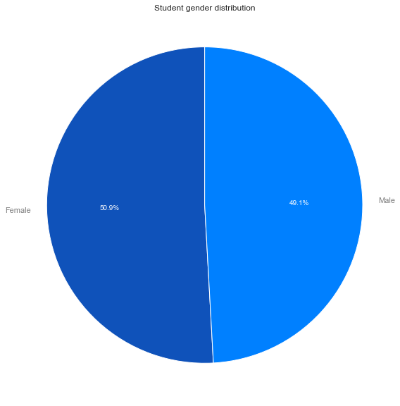


**Student gender conlusion:**
    
Both genders are equivalently represented, so there's no biased in the dataset.

### Scores distribution


```python
pisa_clean[['Overall Score','Math Score','Reading Score','Science Score']].describe()
```


<div>
<style scoped>
    .dataframe tbody tr th:only-of-type {
        vertical-align: middle;
    }

    .dataframe tbody tr th {
        vertical-align: top;
    }

    .dataframe thead th {
        text-align: right;
    }
</style>
<table border="1" class="dataframe">
  <thead>
    <tr style="text-align: right;">
      <th></th>
      <th>Overall Score</th>
      <th>Math Score</th>
      <th>Reading Score</th>
      <th>Science Score</th>
    </tr>
  </thead>
  <tbody>
    <tr>
      <th>count</th>
      <td>258484.000000</td>
      <td>258484.000000</td>
      <td>258484.000000</td>
      <td>258484.000000</td>
    </tr>
    <tr>
      <th>mean</th>
      <td>487.545547</td>
      <td>485.028421</td>
      <td>486.898391</td>
      <td>490.709831</td>
    </tr>
    <tr>
      <th>std</th>
      <td>93.410339</td>
      <td>99.256068</td>
      <td>96.954522</td>
      <td>96.797120</td>
    </tr>
    <tr>
      <th>min</th>
      <td>38.098867</td>
      <td>59.284900</td>
      <td>0.083400</td>
      <td>20.179000</td>
    </tr>
    <tr>
      <th>25%</th>
      <td>421.577092</td>
      <td>413.935200</td>
      <td>421.782600</td>
      <td>422.920600</td>
    </tr>
    <tr>
      <th>50%</th>
      <td>487.251617</td>
      <td>482.325900</td>
      <td>489.408800</td>
      <td>491.085400</td>
    </tr>
    <tr>
      <th>75%</th>
      <td>553.697550</td>
      <td>553.442900</td>
      <td>555.147300</td>
      <td>559.250300</td>
    </tr>
    <tr>
      <th>max</th>
      <td>875.868167</td>
      <td>962.229300</td>
      <td>904.802600</td>
      <td>903.338300</td>
    </tr>
  </tbody>
</table>
</div>


```python
f, axes = plt.subplots(1, 1, figsize=(12, 7), sharex=True)
sb.despine(left=True)
sb.distplot(pisa_clean['Overall Score'], bins=20);

x_ticks = np.arange(0, 1000 + 1, 100)
plt.xticks(x_ticks, x_ticks);
plt.setp(axes, yticks=[]);
plt.xlabel('Overall score distribution');

```

    /Users/rguitter/anaconda3/lib/python3.7/site-packages/scipy/stats/stats.py:1713: FutureWarning: Using a non-tuple sequence for multidimensional indexing is deprecated; use `arr[tuple(seq)]` instead of `arr[seq]`. In the future this will be interpreted as an array index, `arr[np.array(seq)]`, which will result either in an error or a different result.
      return np.add.reduce(sorted[indexer] * weights, axis=axis) / sumval


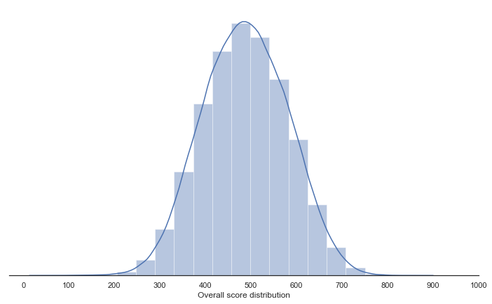


```python
f, axes = plt.subplots(1, 3, figsize=(17, 5), sharex=True)
sb.despine(left=True)

sb.distplot(pisa_clean['Math Score'], ax=axes[0], bins=20)
sb.distplot(pisa_clean['Reading Score'], ax=axes[1], bins=20)
sb.distplot(pisa_clean['Science Score'], ax=axes[2], bins=20)

x_ticks = np.arange(0, 1000 + 1, 100)
plt.xticks(x_ticks, x_ticks);
plt.setp(axes, yticks=[])
plt.tight_layout()
plt.suptitle('Score distribution per discipline', y=1.02)
plt.show();

```


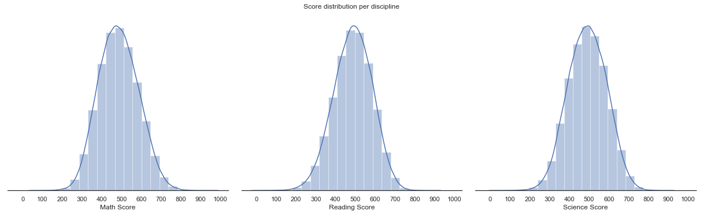


**Scores distribution findings:**

* All the score are normally distributed
* Most of the students' scores are between 350 and 650 points.
* The mean of the distribution is very close to 500 points which is also the mean of the evalution scale. This indicate a well balanced evaluation.

### Immigration status


```python
fig1, ax1 = plt.subplots(1, 1, figsize=(17, 8), sharex=True)
patches, texts, autotexts = ax1.pie(pisa_clean['Immigration Status'].value_counts(), 
                                    colors = ['#4c516d','#0080ff','#008ecc'],
                                    labels=['Native', 'Second Generation', 'First Generation'], 
                                    autopct='%1.1f%%',
                                    startangle=180
                                   );
for text in texts:
    text.set_color('grey')
    
for text in autotexts:
    text.set_color('white')
    
ax1.axis('equal');
plt.tight_layout();
plt.title('Student immigration status distribution')
plt.show();
```


**Immigration Status findings**:

* Most of the students are native
* First and second generation immigrants are equivalently reprensented in the dataset

### Parents highest education level


```python
plt.figure(figsize=[16, 12]);
sb.countplot(x = 'Parents Highest Education', data = pisa_clean, color = sb.color_palette()[0]);

# add annotations
n_points = pisa_clean.shape[0]
cat_counts = pisa_clean['Parents Highest Education'].value_counts()
locs, labels = plt.xticks() # get the current tick locations and labels

# loop through each pair of locations and labels
for loc, label in zip(locs, labels):

    # get the text property for the label to get the correct count
    count = cat_counts[label.get_text()]
    pct_string = '{:0.1f}%'.format(100*count/n_points)

    # print the annotation just below the top of the bar
    plt.text(loc, count-8, pct_string, ha = 'center', va='bottom', color = 'black')

plt.ylabel('Nr. of parents');
plt.xlabel('');
plt.title('Highest parents education distribution', y = 1.02);
```


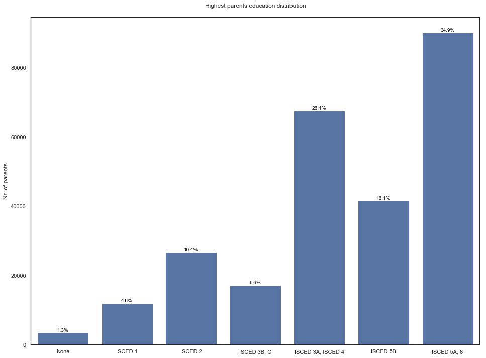


**Parent level of eduction conlusion:**

* By far, most of the parents reach the upper secondary education level
* The first stage of tertiary education is the most common level of education of the parent
* No parents get the second stage of the tertiary education

### Study time with parents


```python
fig1, ax1 = plt.subplots(1, 2, figsize=(17, 8), sharex=True)

sb.boxplot(x=pisa_clean['Study Time With Parent'], orient='v', ax=ax1[0]);
ax1[0].set(ylabel='Nr of hours')

five = pisa_clean[pisa_clean['Study Time With Parent'] < 6]['Study Time With Parent'].value_counts()

patches, texts, autotexts = ax1[1].pie(five, 
                                    colors = ['#4c516d','#003152','#0e4d92','#0f52ba','#0080ff','#008ecc'],
                                    labels=['Not working with parent(s)', '1 hour', '2 hours', '3 hours', '4 hours', '5 hours'], 
                                    autopct='%1.1f%%',
                                    startangle=180
                                   );
for text in texts:
    text.set_color('grey')    
for text in autotexts:
    text.set_color('white')
ax1[1].axis('equal');

plt.suptitle('Study time with parent(s) distribution')
plt.show();
```


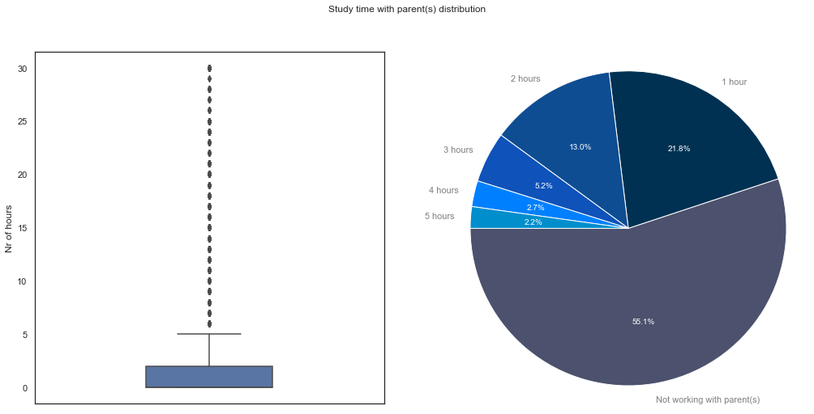


**Study time with parents findings:**

* Some students work up to 30 hours with their parent(s).
* Students working more than 5 hours with their parent(s) is very rare.
* The majority of the students don't work with their parents.
* A significant part of the students work with their parents.

### Parent presence


```python
fig1, ax1 = plt.subplots(1, 1, figsize=(17, 8), sharex=True)
patches, texts, autotexts = ax1.pie(pisa_clean['Parents Presence'].value_counts(), 
                                    colors = ['#4c516d','#008ecc'],
                                    labels=['Both parents','Single parent'],
                                    autopct='%1.1f%%',
                                    startangle=90
                                   );
for text in texts:
    text.set_color('grey')
    
for text in autotexts:
    text.set_color('white')
    
ax1.axis('equal');
plt.tight_layout();
plt.suptitle('Parents presence distribution', y=1.02)
plt.show();
```


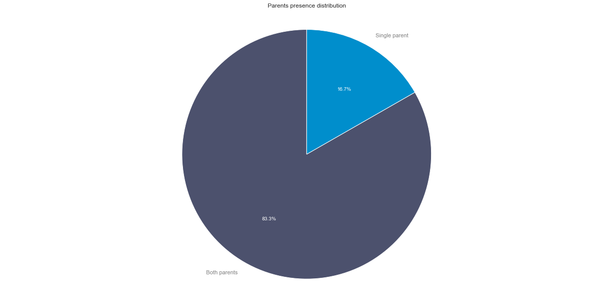


**Single parent family findings**:

* A significant part of the families are single parent

## Bivariate Exploration

> In this section, investigate relationships between pairs of variables in your
data. Make sure the variables that you cover here have been introduced in some
fashion in the previous section (univariate exploration).

### Immigration status and scores


```python
data = pd.melt(pisa_clean, id_vars=['Student Id', 'Gender', 'Country', 'Study Time With Parent', 'Parents Highest Education', 'Immigration Status', 'Parents Presence'], 
               value_vars=['Overall Score','Math Score','Reading Score','Science Score'], 
               var_name="Score Type", value_name='Score')
data['Score Type'] = data['Score Type'].replace('Overall Score', 'Overall').replace('Math Score','Math').replace('Reading Score','Reading').replace('Science Score','Science')

plt.figure(figsize=[12, 16]);
sb.boxplot(x = data['Score Type'], y = data['Score'], hue=data['Immigration Status'], palette = sb.color_palette('husl', 8))
plt.title('Is strudying harder for non native students?');
y_ticks = np.arange(0, 1000 + 1, 100)
plt.yticks(y_ticks, y_ticks);

```


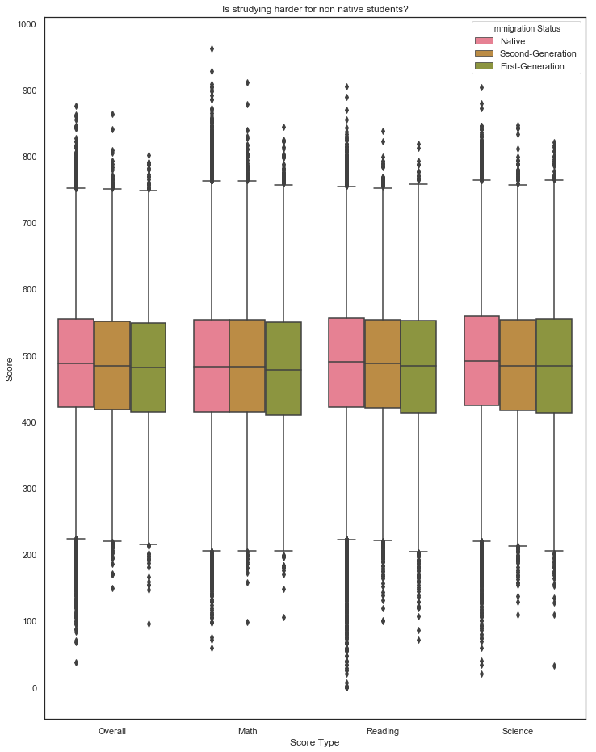


**Immigration status and scores findings:**

* From an overall score point of view, studying seems slighly harder for non native students but the difference in score remains very low.
* In Math, scores are similar between native and second generation strudents while the one for first generation is a bit less. This may be due to the abstract nature of mathematics (where the literary matters less). Afterall mathematics is oftenly quoted as the universal language.

### Parent level education and scores


```python
#parents_he_scores = pisa_clean.groupby(['Parents Highest Education']).mean().reset_index()[['Parents Highest Education','Overall Score','Math Score','Reading Score','Science Score']]
parents_he_scores = pisa_clean[['Parents Highest Education','Overall Score','Math Score','Reading Score','Science Score']]
parents_he_scores.rename({'Overall Score':'Overall', 'Math Score':'Math', 'Reading Score':'Reading', 'Science Score':'Science'},axis=1, inplace=True)
data = pd.melt(parents_he_scores, id_vars=['Parents Highest Education'], 
               value_vars=['Overall','Math','Reading','Science'], 
               var_name="Score Type", value_name='Score Value')

fig, ax = plt.subplots(1, 1, figsize=(14, 12))

ax = sb.pointplot(ax=ax, data = data, 
                  x = 'Parents Highest Education', y='Score Value', hue='Score Type', 
                  dodge=0.3, palette=sb.color_palette('husl', 8), 
                  markers=["o", "x","x","x"], linestyles=["-", "--", "--", "--"]);
#ax = sb.pointplot(ax=ax, data = pisa_clean, x = 'Parents Highest Education', y='Overall Score', hue='Parents Presence', markers=["o", "x","x","x"], linestyles=["-", "--", "--", "--"]);
ax.set(xlabel='Parent Highest Education', ylabel='Score')
plt.title("How parent(s) education impact the student socres ?", y=1.02);

```


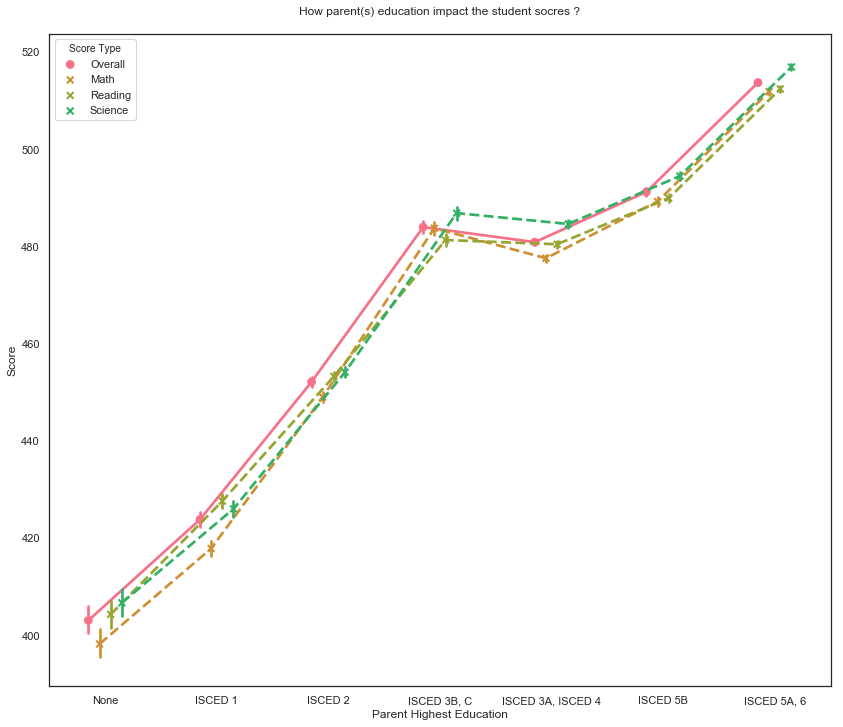


**Parents Highest Education and Scores findings:**

* The highest the parent education is, better the score is.
* 'ISCED 3B, C' is an inflection point. By looking to the slope of the curve, we see that biggest score improvement lie before that point. 
* Having parents who reach the upper secondary or beyond, students tend to perform above the scores mean.

### Study time with parent(s) and scores


```python
scores = pisa_clean.groupby(['Study Time With Parent']).mean().reset_index()[['Study Time With Parent','Overall Score','Math Score','Reading Score','Science Score']]
scores.rename({'Overall Score':'Overall', 'Math Score':'Math', 'Reading Score':'Reading', 'Science Score':'Science'}, axis=1, inplace=True)
data = pd.melt(scores, id_vars=['Study Time With Parent'], 
               value_vars=['Overall','Math','Reading','Science'], 
               var_name="Score Type", value_name='Score')

fig, ax = plt.subplots(1, 2, figsize=(25, 8))

sb.lineplot(ax=ax[0], data = data, 
            x = 'Study Time With Parent', y='Score', hue='Score Type'
           );
ax[0].set(title='Impact on the scores mean', xlabel='Nr. of hours', ylabel='Score')

sb.heatmap(pisa_clean[['Overall Score','Math Score','Reading Score', 'Science Score', 'Study Time With Parent']].corr(), annot = True, fmt = '.3f',
           cmap = 'vlag_r', center = 0)
ax[1].set(title='Correlation between the scores and the time spent studying with parents.')

plt.suptitle("Do students studying with their parent(s) score better than the others?", y=1.02);

```


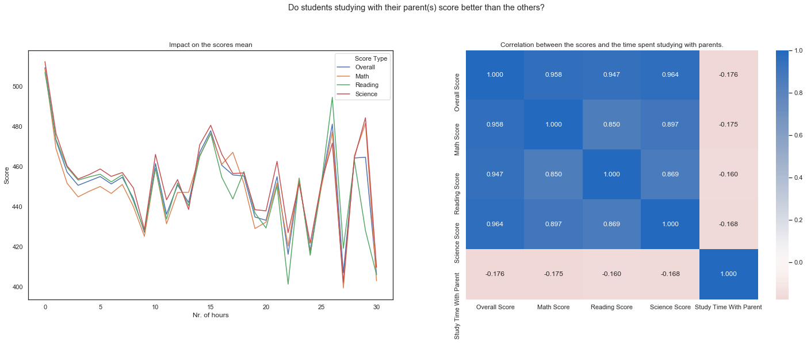


**Study time with parent(s) and scores findings:**

* First let's remember from the univariate exploration that it's very rare that students spend more than 5 hours sudying with their parent(s).
* From the visualization of the scores mean, we see that:
  - when considering only number of hours between 0 and 5, there's a significant drop of about 70 points in the score so studying with parents does not seems to be a factor of success.
  - after 5 hours, the pattern is quite erratic and time spent can have huge impact (negative or positive) on the socres. We can just raise a question about why spending so much time, may be this concerns only students having difficulties and so getting help from their parent(s). We will furhter investigate with 'Parent Presence' to see if single parent have more difficulties to help their children.
* From the visualization correlations, we get the confirmation that there's a weak negative correlation between scores and study time with parent. This looks normal since we expect of students from that age to be autonomous.

### Single parent and scores


```python
data = pd.melt(pisa_clean, id_vars=['Student Id', 'Gender', 'Country', 'Study Time With Parent', 'Parents Highest Education', 'Immigration Status', 'Parents Presence'], 
               value_vars=['Overall Score','Math Score','Reading Score','Science Score'], 
               var_name="Score Type", value_name='Score')
data['Score Type'] = data['Score Type'].replace('Overall Score', 'Overall').replace('Math Score','Math').replace('Reading Score','Reading').replace('Science Score','Science')

palette = sb.color_palette("Paired")

plt.figure(figsize = [15, 14])
ax = sb.violinplot(x = 'Score', y='Score Type', hue='Parents Presence',
                   data=data, palette=palette, split=True,
                   scale="count", inner="quartile");

x_ticks = np.arange(0, 1000 + 1, 100)
plt.xticks(x_ticks, x_ticks);
plt.title("Is studying harder for the single parent students?");


```


    Text(0.5, 1.0, 'Is studying harder for the single parent students?')


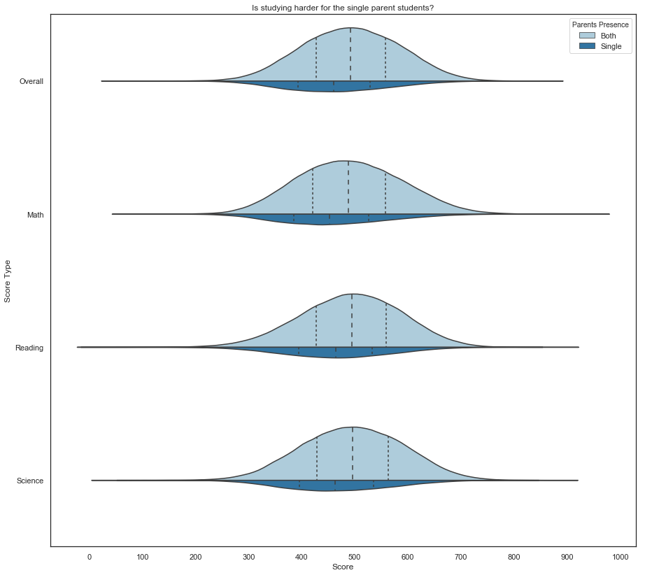


**Parents presence and score findings**:

* Scores for single parent and two-parent are normally distributed.
* Compate to those of students living with two-parent family, the scores of students living in a single parent family are significanlty less (by approximatly 20 points).

## Multivariate Exploration

Since I'm mainly interested in the impact of the parents on the scores, I want to investigate furhtermore by crossing several observations with the Parent Presence.


```python
plt.figure(figsize = [8, 6])

ax = sb.pointplot(data = pisa_clean, 
                  x = 'Immigration Status', y = 'Overall Score', hue = 'Parents Presence',
                  palette = sb.color_palette("Paired")
                 );

plt.title('Is it harder for a non native student coming from a single parent family?');
```


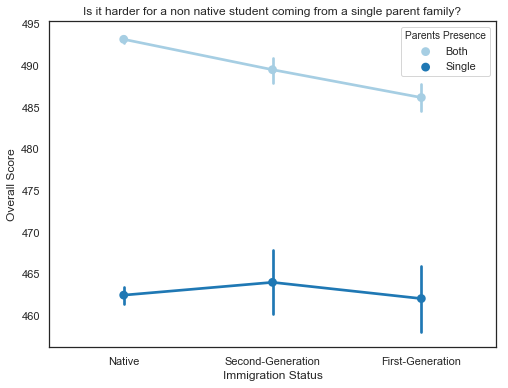


From the bivariate observation, we found that the scores of a student from a single parent family was about 20 points less than for a two-parent family is about 20 points. Now we see that this difference is getting worst if the student is a native.


```python
plt.figure(figsize = [17, 6])

#ax = sb.barplot(data = pisa_clean[pisa_clean['Study Time With Parent'] > 5], x = 'Study Time With Parent', y = 'Overall Score', hue = 'Parents Presence')
ax = sb.pointplot(data = pisa_clean[pisa_clean['Study Time With Parent'] > 5], 
                  x = 'Study Time With Parent', y = 'Overall Score', hue = 'Parents Presence',
                  dodge = 0.1, palette = sb.color_palette('Paired')
                 )
ax.legend(loc = 8, ncol = 3, framealpha = 1, title = 'Parent Presence');
```


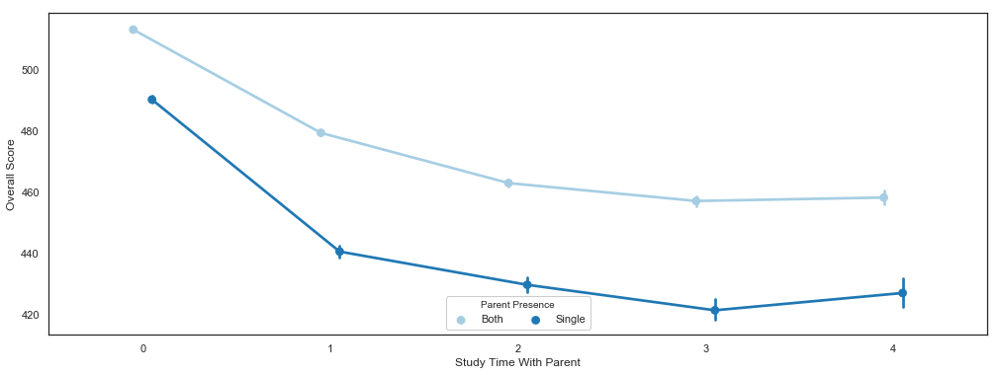


From bivariate observation, we found that when studying time with parent(s) is above 5 hours, it has a very erractic impact (sometimes positive, sometime negative). Now we see that except for 27 hours or more, spending the same amount of time with a student from a single parent family is less efficient than from two-parent family.
Also, we see that the difference of score between single parent and two-parent family is greater 20 points (the overall difference we obersve between scores).


```python
plt.figure(figsize = [14, 12])
ax = sb.pointplot(data = pisa_clean, 
                  x = 'Parents Highest Education', y='Overall Score', hue='Parents Presence', 
                  palette = sb.color_palette("Paired"));

```


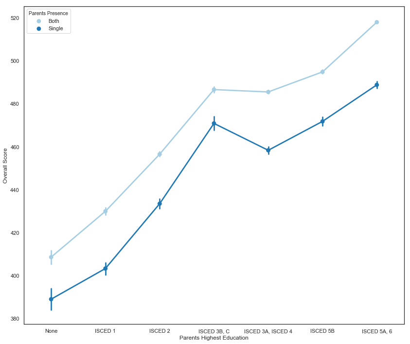


From bivariate observation, we found that the highest education of parents lead to a highest score of the student and 
'ISCED 3B, C' was an inflection point .
Now we see that this not 'ISCED 3B, C' is trully an inflection point for single parent family but not for two-parent family. Plus the gain in score between Uppser secondary and First stage ternary is more important for two-parent family (about 30 points) than for single parent family (about 10 points).
Prior observations on Parent Highest Education impact are unchanged for education level comprised between None and the Upper secondary (ISCED 3B). However, beyond that point, we see that the Highest Parent Education are more positive impact on the score when the student comes from a two-parent family.


```python

```
