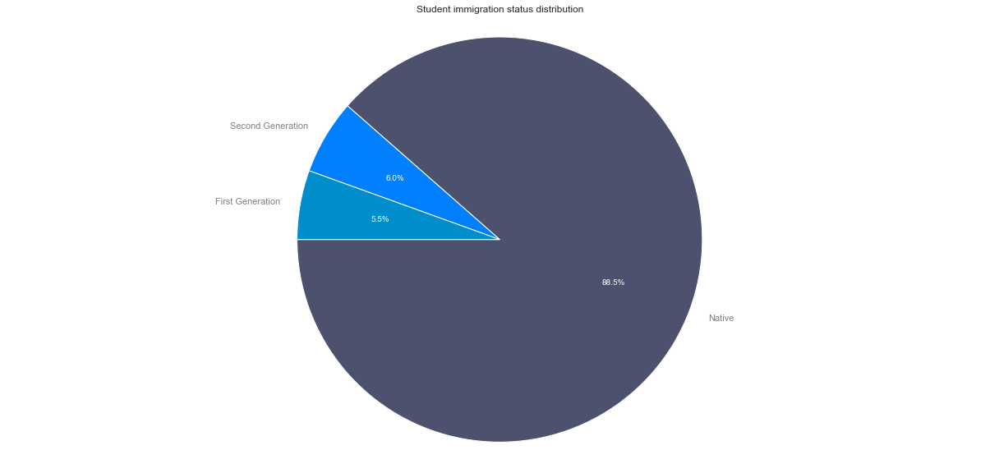

# PISA 2012
## by Richard Guitter

## Preliminary Wrangling

The Programme for International Student Assessment (PISA) is a triennial international survey which aims to evaluate education systems worldwide by testing the skills and knowledge of 15-year-old students who are nearing the end of their compulsory education. PISA assesses how well they can apply what they learn in school to real-life situations. 

This dataset contains the result of the survey for 2012. 


```python
# import all packages and set plots to be embedded inline
import numpy as np
import pandas as pd
import matplotlib.pyplot as plt
import seaborn as sb

%matplotlib inline

pd.set_option('display.max_columns', 636)
```

```python
pisa.shape
```


    (485490, 635)


The data set contains 635 features and 485490 student survey results. So it's a very reach dataset which requires some work to understand the features (hopefully there's the dicitionnary) and then filter out the features of interest.

I'm mainly interested by the impact of the parents on the students scores.
So first I need the scores. Those are expressed via a set of plausible value for mathematic, reading and science: PV1MATH, PV1READ, PV1SCIE.

For the parental context I will focus on:
* the level of education of the parents (HISCED);
* the presence of the parents at home (ST11Q01: Mother at Home, ST11Q02: Father at Home)
* the work of the parents (ST15Q01: mother, ST19Q01: father)
* the time that parent spend working with the student (ST57Q05)

To that set of observation I will add 'IMMIG' to measure cultural aspects.


```python
pisa = pisa[['STIDSTD','ST04Q01','CNT','PV1MATH','PV1READ','PV1SCIE','ST11Q01','ST11Q02','ST57Q05','HISCED','IMMIG']]
pisa.rename({'STIDSTD':'Student Id', 'ST04Q01':'Gender','CNT':'Country', 
             'PV1MATH':'Math Score', 'PV1READ':"Reading Score",'PV1SCIE':'Science Score',
             'ST11Q01':'Mother Present', 'ST11Q02':'Father Present', 'ST57Q05':'Study Time With Parent',
             'HISCED':'Parents Highest Education', 'IMMIG':'Immigration Status'
            }, 
            axis='columns', inplace=True)
```


```python
pisa.head()
```


<div>
<style scoped>
    .dataframe tbody tr th:only-of-type {
        vertical-align: middle;
    }

    .dataframe tbody tr th {
        vertical-align: top;
    }

    .dataframe thead th {
        text-align: right;
    }
</style>
<table border="1" class="dataframe">
  <thead>
    <tr style="text-align: right;">
      <th></th>
      <th>Student Id</th>
      <th>Gender</th>
      <th>Country</th>
      <th>Math Score</th>
      <th>Reading Score</th>
      <th>Science Score</th>
      <th>Mother Present</th>
      <th>Father Present</th>
      <th>Study Time With Parent</th>
      <th>Parents Highest Education</th>
      <th>Immigration Status</th>
    </tr>
  </thead>
  <tbody>
    <tr>
      <th>1</th>
      <td>1</td>
      <td>Female</td>
      <td>Albania</td>
      <td>406.8469</td>
      <td>249.5762</td>
      <td>341.7009</td>
      <td>Yes</td>
      <td>Yes</td>
      <td>NaN</td>
      <td>ISCED 3A, ISCED 4</td>
      <td>Native</td>
    </tr>
    <tr>
      <th>2</th>
      <td>2</td>
      <td>Female</td>
      <td>Albania</td>
      <td>486.1427</td>
      <td>406.2936</td>
      <td>548.9929</td>
      <td>Yes</td>
      <td>Yes</td>
      <td>0.0</td>
      <td>ISCED 5A, 6</td>
      <td>Native</td>
    </tr>
    <tr>
      <th>3</th>
      <td>3</td>
      <td>Female</td>
      <td>Albania</td>
      <td>533.2684</td>
      <td>401.2100</td>
      <td>499.6643</td>
      <td>Yes</td>
      <td>Yes</td>
      <td>2.0</td>
      <td>ISCED 5A, 6</td>
      <td>Native</td>
    </tr>
    <tr>
      <th>4</th>
      <td>4</td>
      <td>Female</td>
      <td>Albania</td>
      <td>412.2215</td>
      <td>547.3630</td>
      <td>438.6796</td>
      <td>Yes</td>
      <td>Yes</td>
      <td>0.0</td>
      <td>ISCED 5A, 6</td>
      <td>Native</td>
    </tr>
    <tr>
      <th>5</th>
      <td>5</td>
      <td>Female</td>
      <td>Albania</td>
      <td>381.9209</td>
      <td>311.7707</td>
      <td>361.5628</td>
      <td>Yes</td>
      <td>Yes</td>
      <td>NaN</td>
      <td>ISCED 3A, ISCED 4</td>
      <td>Native</td>
    </tr>
  </tbody>
</table>
</div>


```python
pisa.dtypes
```


    Student Id                     int64
    Gender                        object
    Country                       object
    Math Score                   float64
    Reading Score                float64
    Science Score                float64
    Mother Present                object
    Father Present                object
    Study Time With Parent       float64
    Parents Highest Education     object
    Immigration Status            object
    dtype: object


### Further Data Wrangling
#### Data assessment


```python
print(pisa.shape)
for col in pisa.columns: 
    print('{} contains {} null value'.format(col, pisa[col].isna().sum())) 
```

    (485490, 11)
    Student Id contains 0 null value
    Gender contains 0 null value
    Country contains 0 null value
    Math Score contains 0 null value
    Reading Score contains 0 null value
    Science Score contains 0 null value
    Mother Present contains 24931 null value
    Father Present contains 44454 null value
    Study Time With Parent contains 195988 null value
    Parents Highest Education contains 12399 null value
    Immigration Status contains 13697 null value


```python
pisa.describe()
```


<div>
<style scoped>
    .dataframe tbody tr th:only-of-type {
        vertical-align: middle;
    }

    .dataframe tbody tr th {
        vertical-align: top;
    }

    .dataframe thead th {
        text-align: right;
    }
</style>
<table border="1" class="dataframe">
  <thead>
    <tr style="text-align: right;">
      <th></th>
      <th>Student Id</th>
      <th>Math Score</th>
      <th>Reading Score</th>
      <th>Science Score</th>
      <th>Study Time With Parent</th>
    </tr>
  </thead>
  <tbody>
    <tr>
      <th>count</th>
      <td>485490.000000</td>
      <td>485490.000000</td>
      <td>485490.000000</td>
      <td>485490.000000</td>
      <td>289502.000000</td>
    </tr>
    <tr>
      <th>mean</th>
      <td>6134.066201</td>
      <td>469.621653</td>
      <td>472.004640</td>
      <td>475.769824</td>
      <td>1.213363</td>
    </tr>
    <tr>
      <th>std</th>
      <td>6733.144944</td>
      <td>103.265391</td>
      <td>102.505523</td>
      <td>101.464426</td>
      <td>2.353292</td>
    </tr>
    <tr>
      <th>min</th>
      <td>1.000000</td>
      <td>19.792800</td>
      <td>0.083400</td>
      <td>2.648300</td>
      <td>0.000000</td>
    </tr>
    <tr>
      <th>25%</th>
      <td>1811.000000</td>
      <td>395.318600</td>
      <td>403.600700</td>
      <td>404.457300</td>
      <td>0.000000</td>
    </tr>
    <tr>
      <th>50%</th>
      <td>3740.000000</td>
      <td>466.201900</td>
      <td>475.455000</td>
      <td>475.699400</td>
      <td>0.000000</td>
    </tr>
    <tr>
      <th>75%</th>
      <td>7456.000000</td>
      <td>541.057800</td>
      <td>544.502500</td>
      <td>547.780700</td>
      <td>2.000000</td>
    </tr>
    <tr>
      <th>max</th>
      <td>33806.000000</td>
      <td>962.229300</td>
      <td>904.802600</td>
      <td>903.338300</td>
      <td>30.000000</td>
    </tr>
  </tbody>
</table>
</div>


```python
print(pisa.Gender.unique())
print(pisa['Mother Present'].unique())
print(pisa['Father Present'].unique())
print(pisa['Parents Highest Education'].unique())
print(pisa['Immigration Status'].unique())
```

    ['Female' 'Male']
    ['Yes' nan 'No']
    ['Yes' nan 'No']
    ['ISCED 3A, ISCED 4' 'ISCED 5A, 6' 'ISCED 3B, C' 'ISCED 2' 'ISCED 5B'
     'None' 'ISCED 1' nan]
    ['Native' nan 'Second-Generation' 'First-Generation']


#### Fixing missing values

To avoid any biased regarding the observations relative to parents, I prefer to drop the records containing null values. This will lead to a significant drop in the dataset however since I'm not interested by the representation of countries this does not matter.


```python
pisa_clean = pisa.dropna(subset=['Mother Present', 'Father Present', 'Study Time With Parent', 'Parents Highest Education', 'Immigration Status'])
pisa_clean.shape

```


    (258484, 11)


```python
pisa_clean.head()
```


<div>
<style scoped>
    .dataframe tbody tr th:only-of-type {
        vertical-align: middle;
    }

    .dataframe tbody tr th {
        vertical-align: top;
    }

    .dataframe thead th {
        text-align: right;
    }
</style>
<table border="1" class="dataframe">
  <thead>
    <tr style="text-align: right;">
      <th></th>
      <th>Student Id</th>
      <th>Gender</th>
      <th>Country</th>
      <th>Math Score</th>
      <th>Reading Score</th>
      <th>Science Score</th>
      <th>Mother Present</th>
      <th>Father Present</th>
      <th>Study Time With Parent</th>
      <th>Parents Highest Education</th>
      <th>Immigration Status</th>
    </tr>
  </thead>
  <tbody>
    <tr>
      <th>2</th>
      <td>2</td>
      <td>Female</td>
      <td>Albania</td>
      <td>486.1427</td>
      <td>406.2936</td>
      <td>548.9929</td>
      <td>Yes</td>
      <td>Yes</td>
      <td>0.0</td>
      <td>ISCED 5A, 6</td>
      <td>Native</td>
    </tr>
    <tr>
      <th>3</th>
      <td>3</td>
      <td>Female</td>
      <td>Albania</td>
      <td>533.2684</td>
      <td>401.2100</td>
      <td>499.6643</td>
      <td>Yes</td>
      <td>Yes</td>
      <td>2.0</td>
      <td>ISCED 5A, 6</td>
      <td>Native</td>
    </tr>
    <tr>
      <th>4</th>
      <td>4</td>
      <td>Female</td>
      <td>Albania</td>
      <td>412.2215</td>
      <td>547.3630</td>
      <td>438.6796</td>
      <td>Yes</td>
      <td>Yes</td>
      <td>0.0</td>
      <td>ISCED 5A, 6</td>
      <td>Native</td>
    </tr>
    <tr>
      <th>6</th>
      <td>6</td>
      <td>Female</td>
      <td>Albania</td>
      <td>396.3312</td>
      <td>378.2544</td>
      <td>384.3156</td>
      <td>Yes</td>
      <td>Yes</td>
      <td>1.0</td>
      <td>ISCED 3B, C</td>
      <td>Native</td>
    </tr>
    <tr>
      <th>7</th>
      <td>7</td>
      <td>Female</td>
      <td>Albania</td>
      <td>438.0823</td>
      <td>373.2503</td>
      <td>508.1499</td>
      <td>Yes</td>
      <td>Yes</td>
      <td>0.0</td>
      <td>ISCED 5A, 6</td>
      <td>Native</td>
    </tr>
  </tbody>
</table>
</div>


#### Collate 'parents presence' into a single column


```python
pisa_clean['Parents Presence'] = ((pisa_clean['Mother Present'] == 'No') | (pisa_clean['Father Present'] == 'No')).replace(False, 'Both').replace(True, 'Single')
pisa_clean = pisa_clean.drop(['Mother Present','Father Present'], axis=1)
#pisa_clean.assign(SingleParent = (pisa_clean.MotherPresent == 'No') | (pisa_clean.FatherPresent == 'No'))
pisa_clean.head()
```


<div>
<style scoped>
    .dataframe tbody tr th:only-of-type {
        vertical-align: middle;
    }

    .dataframe tbody tr th {
        vertical-align: top;
    }

    .dataframe thead th {
        text-align: right;
    }
</style>
<table border="1" class="dataframe">
  <thead>
    <tr style="text-align: right;">
      <th></th>
      <th>Student Id</th>
      <th>Gender</th>
      <th>Country</th>
      <th>Math Score</th>
      <th>Reading Score</th>
      <th>Science Score</th>
      <th>Study Time With Parent</th>
      <th>Parents Highest Education</th>
      <th>Immigration Status</th>
      <th>Parents Presence</th>
    </tr>
  </thead>
  <tbody>
    <tr>
      <th>2</th>
      <td>2</td>
      <td>Female</td>
      <td>Albania</td>
      <td>486.1427</td>
      <td>406.2936</td>
      <td>548.9929</td>
      <td>0.0</td>
      <td>ISCED 5A, 6</td>
      <td>Native</td>
      <td>Both</td>
    </tr>
    <tr>
      <th>3</th>
      <td>3</td>
      <td>Female</td>
      <td>Albania</td>
      <td>533.2684</td>
      <td>401.2100</td>
      <td>499.6643</td>
      <td>2.0</td>
      <td>ISCED 5A, 6</td>
      <td>Native</td>
      <td>Both</td>
    </tr>
    <tr>
      <th>4</th>
      <td>4</td>
      <td>Female</td>
      <td>Albania</td>
      <td>412.2215</td>
      <td>547.3630</td>
      <td>438.6796</td>
      <td>0.0</td>
      <td>ISCED 5A, 6</td>
      <td>Native</td>
      <td>Both</td>
    </tr>
    <tr>
      <th>6</th>
      <td>6</td>
      <td>Female</td>
      <td>Albania</td>
      <td>396.3312</td>
      <td>378.2544</td>
      <td>384.3156</td>
      <td>1.0</td>
      <td>ISCED 3B, C</td>
      <td>Native</td>
      <td>Both</td>
    </tr>
    <tr>
      <th>7</th>
      <td>7</td>
      <td>Female</td>
      <td>Albania</td>
      <td>438.0823</td>
      <td>373.2503</td>
      <td>508.1499</td>
      <td>0.0</td>
      <td>ISCED 5A, 6</td>
      <td>Native</td>
      <td>Both</td>
    </tr>
  </tbody>
</table>
</div>


#### Calculate the 'overall score'


```python
pisa_clean['Overall Score'] = (pisa_clean['Math Score'] + pisa_clean['Reading Score'] + pisa_clean['Science Score']) / 3
pisa_clean.head()
```


<div>
<style scoped>
    .dataframe tbody tr th:only-of-type {
        vertical-align: middle;
    }

    .dataframe tbody tr th {
        vertical-align: top;
    }

    .dataframe thead th {
        text-align: right;
    }
</style>
<table border="1" class="dataframe">
  <thead>
    <tr style="text-align: right;">
      <th></th>
      <th>Student Id</th>
      <th>Gender</th>
      <th>Country</th>
      <th>Math Score</th>
      <th>Reading Score</th>
      <th>Science Score</th>
      <th>Study Time With Parent</th>
      <th>Parents Highest Education</th>
      <th>Immigration Status</th>
      <th>Parents Presence</th>
      <th>Overall Score</th>
    </tr>
  </thead>
  <tbody>
    <tr>
      <th>2</th>
      <td>2</td>
      <td>Female</td>
      <td>Albania</td>
      <td>486.1427</td>
      <td>406.2936</td>
      <td>548.9929</td>
      <td>0.0</td>
      <td>ISCED 5A, 6</td>
      <td>Native</td>
      <td>Both</td>
      <td>480.476400</td>
    </tr>
    <tr>
      <th>3</th>
      <td>3</td>
      <td>Female</td>
      <td>Albania</td>
      <td>533.2684</td>
      <td>401.2100</td>
      <td>499.6643</td>
      <td>2.0</td>
      <td>ISCED 5A, 6</td>
      <td>Native</td>
      <td>Both</td>
      <td>478.047567</td>
    </tr>
    <tr>
      <th>4</th>
      <td>4</td>
      <td>Female</td>
      <td>Albania</td>
      <td>412.2215</td>
      <td>547.3630</td>
      <td>438.6796</td>
      <td>0.0</td>
      <td>ISCED 5A, 6</td>
      <td>Native</td>
      <td>Both</td>
      <td>466.088033</td>
    </tr>
    <tr>
      <th>6</th>
      <td>6</td>
      <td>Female</td>
      <td>Albania</td>
      <td>396.3312</td>
      <td>378.2544</td>
      <td>384.3156</td>
      <td>1.0</td>
      <td>ISCED 3B, C</td>
      <td>Native</td>
      <td>Both</td>
      <td>386.300400</td>
    </tr>
    <tr>
      <th>7</th>
      <td>7</td>
      <td>Female</td>
      <td>Albania</td>
      <td>438.0823</td>
      <td>373.2503</td>
      <td>508.1499</td>
      <td>0.0</td>
      <td>ISCED 5A, 6</td>
      <td>Native</td>
      <td>Both</td>
      <td>439.827500</td>
    </tr>
  </tbody>
</table>
</div>


#### Fix type issues

* StudyTimeWithParent is an int64
* Gender, ParentsHighestEducation and ImmigrationStatus are categories 


```python
pisa_clean.loc[:,'Study Time With Parent'] = pisa_clean['Study Time With Parent'].astype('int64')

gender_dtype = pd.api.types.CategoricalDtype(categories=['Female','Male'])
pisa_clean.loc[:,'Gender'] = pisa_clean.Gender.astype(gender_dtype)

parents_presence_dtype = pd.api.types.CategoricalDtype(categories=['Both','Single'])
pisa_clean.loc[:,'Parents Presence'] = pisa_clean['Parents Presence'].astype(parents_presence_dtype)

parentHE_dtype = pd.api.types.CategoricalDtype(
                    categories=['None','ISCED 1','ISCED 2','ISCED 3B, C','ISCED 3A, ISCED 4','ISCED 5B','ISCED 5A, 6'],
                    ordered=True)
pisa_clean.loc[:,'Parents Highest Education'] = pisa_clean['Parents Highest Education'].astype(parentHE_dtype)

immig_dtype = pd.api.types.CategoricalDtype(categories=['Native','Second-Generation','First-Generation'], ordered=True)
pisa_clean.loc[:,'Immigration Status'] = pisa_clean['Immigration Status'].astype(immig_dtype)

pisa_clean.dtypes

```


    Student Id                      int64
    Gender                       category
    Country                        object
    Math Score                    float64
    Reading Score                 float64
    Science Score                 float64
    Study Time With Parent          int64
    Parents Highest Education    category
    Immigration Status           category
    Parents Presence             category
    Overall Score                 float64
    dtype: object


#### Check the data


```python
print(pisa_clean.Gender.unique())
print(pisa_clean['Parents Presence'].unique())
print(pisa_clean['Parents Highest Education'].unique())
print(pisa_clean['Immigration Status'].unique())
```

    [Female, Male]
    Categories (2, object): [Female, Male]
    [Both, Single]
    Categories (2, object): [Both, Single]
    [ISCED 5A, 6, ISCED 3B, C, ISCED 3A, ISCED 4, ISCED 2, ISCED 5B, None, ISCED 1]
    Categories (7, object): [None < ISCED 1 < ISCED 2 < ISCED 3B, C < ISCED 3A, ISCED 4 < ISCED 5B < ISCED 5A, 6]
    [Native, Second-Generation, First-Generation]
    Categories (3, object): [Native < Second-Generation < First-Generation]


```python
# save to a file
pisa_clean.to_csv("pisa2012_clean.csv", index=False, encoding='latin-1')
```

## Univariate Exploration

> In this section, investigate distributions of individual variables. If
you see unusual points or outliers, take a deeper look to clean things up
and prepare yourself to look at relationships between variables.

### Gender distribution


```python
pisa_clean.Gender.value_counts()
```


    Female    131511
    Male      126973
    Name: Gender, dtype: int64


    
Both genders are equivalently represented, so there's no biased in the dataset.

### Scores distribution


```python
pisa_clean[['Overall Score','Math Score','Reading Score','Science Score']].describe()
```


<div>
<style scoped>
    .dataframe tbody tr th:only-of-type {
        vertical-align: middle;
    }

    .dataframe tbody tr th {
        vertical-align: top;
    }

    .dataframe thead th {
        text-align: right;
    }
</style>
<table border="1" class="dataframe">
  <thead>
    <tr style="text-align: right;">
      <th></th>
      <th>Overall Score</th>
      <th>Math Score</th>
      <th>Reading Score</th>
      <th>Science Score</th>
    </tr>
  </thead>
  <tbody>
    <tr>
      <th>count</th>
      <td>258484.000000</td>
      <td>258484.000000</td>
      <td>258484.000000</td>
      <td>258484.000000</td>
    </tr>
    <tr>
      <th>mean</th>
      <td>487.545547</td>
      <td>485.028421</td>
      <td>486.898391</td>
      <td>490.709831</td>
    </tr>
    <tr>
      <th>std</th>
      <td>93.410339</td>
      <td>99.256068</td>
      <td>96.954522</td>
      <td>96.797120</td>
    </tr>
    <tr>
      <th>min</th>
      <td>38.098867</td>
      <td>59.284900</td>
      <td>0.083400</td>
      <td>20.179000</td>
    </tr>
    <tr>
      <th>25%</th>
      <td>421.577092</td>
      <td>413.935200</td>
      <td>421.782600</td>
      <td>422.920600</td>
    </tr>
    <tr>
      <th>50%</th>
      <td>487.251617</td>
      <td>482.325900</td>
      <td>489.408800</td>
      <td>491.085400</td>
    </tr>
    <tr>
      <th>75%</th>
      <td>553.697550</td>
      <td>553.442900</td>
      <td>555.147300</td>
      <td>559.250300</td>
    </tr>
    <tr>
      <th>max</th>
      <td>875.868167</td>
      <td>962.229300</td>
      <td>904.802600</td>
      <td>903.338300</td>
    </tr>
  </tbody>
</table>
</div>


    /Users/rguitter/anaconda3/lib/python3.7/site-packages/scipy/stats/stats.py:1713: FutureWarning: Using a non-tuple sequence for multidimensional indexing is deprecated; use `arr[tuple(seq)]` instead of `arr[seq]`. In the future this will be interpreted as an array index, `arr[np.array(seq)]`, which will result either in an error or a different result.
      return np.add.reduce(sorted[indexer] * weights, axis=axis) / sumval


* All the score are normally distributed
* Most of the students' scores are between 350 and 650 points.
* The mean of the distribution is very close to 500 points which is also the mean of the evalution scale. This indicate a well balanced evaluation.

### Immigration status





* Most of the students are native
* First and second generation immigrants are equivalently reprensented in the dataset

### Parents highest education level


* By far, most of the parents reach the upper secondary education level
* The first stage of tertiary education is the most common level of education of the parent
* No parents get the second stage of the tertiary education

### Study time with parents


* Some students work up to 30 hours with their parent(s).
* Students working more than 5 hours with their parent(s) is very rare.
* The majority of the students don't work with their parents.
* A significant part of the students work with their parents.

### Parent presence


* A significant part of the families are single parent

## Bivariate Exploration

### Immigration status and scores


* From an overall score point of view, studying seems slighly harder for non native students but the difference in score remains very low.
* In Math, scores are similar between native and second generation strudents while the one for first generation is a bit less. This may be due to the abstract nature of mathematics (where the literary matters less). Afterall mathematics is oftenly quoted as the universal language.

### Parent level education and scores


* The highest the parent education is, better the score is.
* 'ISCED 3B, C' is an inflection point. By looking to the slope of the curve, we see that biggest score improvement lie before that point. 
* Having parents who reach the upper secondary or beyond, students tend to perform above the scores mean.

### Study time with parent(s) and scores


* First let's remember from the univariate exploration that it's very rare that students spend more than 5 hours sudying with their parent(s).
* From the visualization of the scores mean, we see that:
  - when considering only number of hours between 0 and 5, there's a significant drop of about 70 points in the score so studying with parents does not seems to be a factor of success.
  - after 5 hours, the pattern is quite erratic and time spent can have huge impact (negative or positive) on the socres. We can just raise a question about why spending so much time, may be this concerns only students having difficulties and so getting help from their parent(s). We will furhter investigate with 'Parent Presence' to see if single parent have more difficulties to help their children.
* From the visualization correlations, we get the confirmation that there's a weak negative correlation between scores and study time with parent. This looks normal since we expect of students from that age to be autonomous.

### Single parent and scores


* Scores for single parent and two-parent are normally distributed.
* Compate to those of students living with two-parent family, the scores of students living in a single parent family are significanlty less (by approximatly 20 points).

## Multivariate Exploration

Since I'm mainly interested in the impact of the parents on the scores, I want to investigate furhtermore by crossing several observations with the Parent Presence.


From the bivariate observation, we found that the scores of a student from a single parent family was about 20 points less than for a two-parent family is about 20 points. Now we see that this difference is getting worst if the student is a native.


From bivariate observation, we found that when studying time with parent(s) is above 5 hours, it has a very erractic impact (sometimes positive, sometime negative). Now we see that except for 27 hours or more, spending the same amount of time with a student from a single parent family is less efficient than from two-parent family.
Also, we see that the difference of score between single parent and two-parent family is greater 20 points (the overall difference we obersve between scores).


From bivariate observation, we found that the highest education of parents lead to a highest score of the student and 
'ISCED 3B, C' was an inflection point .
Now we see that this not 'ISCED 3B, C' is trully an inflection point for single parent family but not for two-parent family. Plus the gain in score between Uppser secondary and First stage ternary is more important for two-parent family (about 30 points) than for single parent family (about 10 points).
Prior observations on Parent Highest Education impact are unchanged for education level comprised between None and the Upper secondary (ISCED 3B). However, beyond that point, we see that the Highest Parent Education are more positive impact on the score when the student comes from a two-parent family.


## Preparation of the presentation

I will re-use most of the figures because I already polish it. However the boxplot for the TimeStudyWithParent is not good looking and the pie need to be rework to display hours beyong 5 as one slice.

The presentation require also to resize some of the figures and also to polish the title and the axis labels (wording, position, size).

Most of the slide title are shaped as questions to raise the attention to the attendies. The same goes for the title of the figure.